# 基于eBPF的容器异常检测框架与方法

## 团队

- 选题 ：   proj384
- 学校 ：   国防科技大学
- 队伍 ：   三个臭皮匠
- 参赛队编号 ： T202590002995558
- 参赛队员 ：   毕喜舒    刘周康    马永媛
- 指导教师 ：   任怡   赵欣

## 简介

常见的容器异常检测方法包括基于统计的算法、基于规则的算法、基于人工智能的算法等。本项目综合这些方法的优势，采用基于 eBPF 的容器异常检测技术，构建了轻量化、高性能的容器异常检测框架Agent。

Agent 通过 Linux eBPF 技术在运行时监控容器行为与系统指标，实时收集进程生命周期、系统调用、文件操作、网络连接等细粒度数据，结合多维度异常检测模型识别可疑行为。其核心优势在于内核级观测能力，可突破传统用户态监控的局限性，适配容器高动态性与隔离性特点。

Agent 具备性能分析、容器集群网络可视化、安全告警、一键部署等功能，核心二进制文件仅 4MB，支持 Linux 内核≥5.10 环境，可无缝集成 Prometheus、Grafana 等云原生工具。

此外，Agent 支持容器异常注入功能，可模拟 CPU 密集、内存泄漏、端口扫描等≥12 类异常场景，形成 “注入→采集→检测→告警→报告” 的闭环评测链路，为模型优化与功能验证提供标准化测试基准。
## 优势与特点

- 内核级动态观测：基于 eBPF 技术实现内核态直接数据采集，覆盖进程、系统调用、文件、网络等关键观测点，数据延迟降至毫秒级，解决短生命周期容器追踪难题。
- 轻量化与可扩展性：核心 Agent运行时 CPU 占用≤5%、内存≤120MB，性能损耗≤2%；支持动态加载 / 卸载 eBPF 探针，可按需扩展监控维度。
- 多维度异常检测：融合三层检测模型
规则引擎：基于安全基线（如敏感文件访问、危险系统调用）实时告警；
统计分析：识别资源指标突增 / 突减等异常波动；
机器学习：采用 Isolation Forest 无监督算法，适配容器动态特性，检测高维时序数据中的未知异常。
- 容器异常注入能力：提供场景化异常库，支持强度、时长配置，可生成带标签数据，用于模型训练与检测效果评测，确保对宿主影响可控。
- 实时告警与通知：采用实时告警机制，及时发现异常情况并通知相关人员。同时，支持自定义告警规则，满足不同场景的需求。
- 云原生深度集成： 支持 Prometheus 时序数据存储、Grafana 可视化展示，适配 Docker、Kubernetes 环境，支持跨节点容器统一管理。

## 项目目标

- 开发基于 eBPF 的容器运行时数据采集框架，覆盖进程、系统调用、文件、网络等核心指标；
- 设计多维度异常检测算法，实现规则、统计与机器学习的协同检测；
- 构建容器异常注入与评测闭环，支持≥12 类异常场景模拟，输出结构化标签数据与评测报告；
- 利用grafana、Prometheus等工具进行数据异常展示，形成分析报告。

## 技术报告与结果说明

-   为快速了解本项目，可以先查看后续内容，详细内容请见[技术报告](doc/决赛技术报告.pdf)
-   我们在百度网盘中也上传了项目的成果展示与过程讲解的视频，视频全长约20分钟，您可以在[这里](https://pan.baidu.com/s/1ke2WzuBgRWk2TMY38yONhg?pwd=mttk)下载观看。
-   为了方便您直接了解项目的成果，我们也上传了一个精简的无讲解的成果展示视频，视频时长只有4分钟，您可以在[这里](https://pan.baidu.com/s/13-18WFZn6A3JIq8ZC327lg?pwd=c99w)查看。
-   若需要了解本项目的进展，清查看[项目进展](doc/决赛项目进展.pdf)

## 总体框架
- 总体框架图如下，该框架图介绍了本项目构建的监控系统的总体框架，包括容器层、采集层、告警层和展示层。
- 容器层：管理 Docker/K8s 容器环境，实现自动化部署与颗粒度编排；
- 采集层：通过 eBPF 探针捕获内核级事件，经环形缓冲区传输至用户态，统一数据格式；
- 告警层：整合规则引擎、统计引擎、机器学习引擎，实现异常检测与告警分级；
- 展示层：通过 Prometheus 存储数据，Grafana 可视化展示，支持前后端交互与异常溯源。
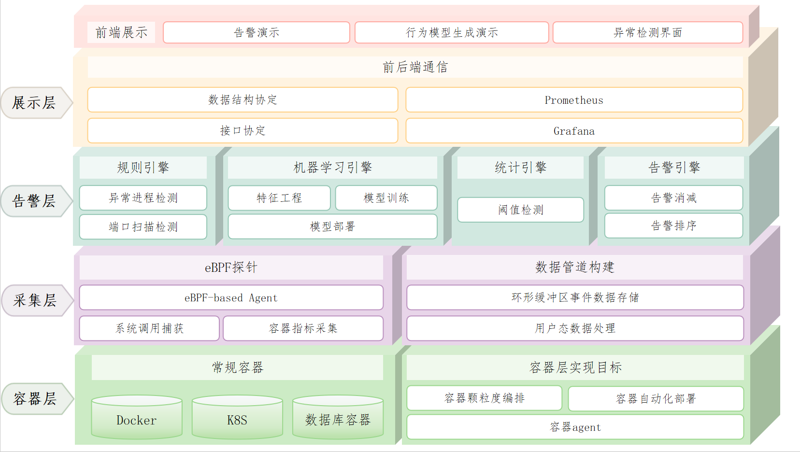

## 功能结构
下图为本项目的功能结构图，主要展示数据流向。本项目的监控观测工具功能的数据流向主要有三部分：一部分以json,csv和database等格式被采集存储；一部分由Analyzer模块进行分析处理；还有一部分通过grafana等工具被展示。
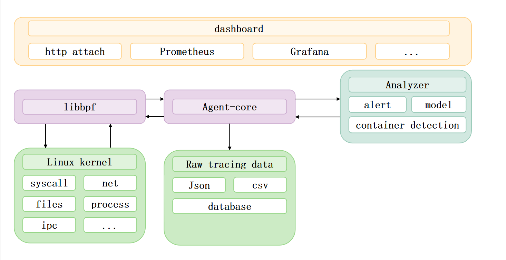

## 代码架构

本项目的代码架构如下图，具体的代码分析在技术报告中。

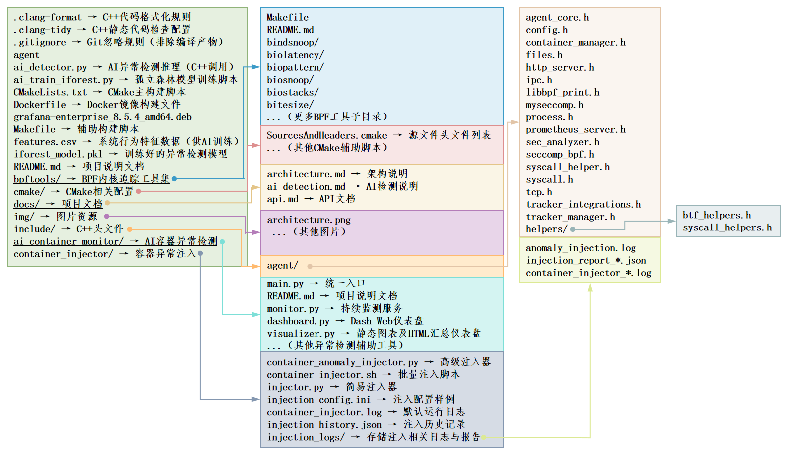

## 核心板块设计

### eBPF 探针模块

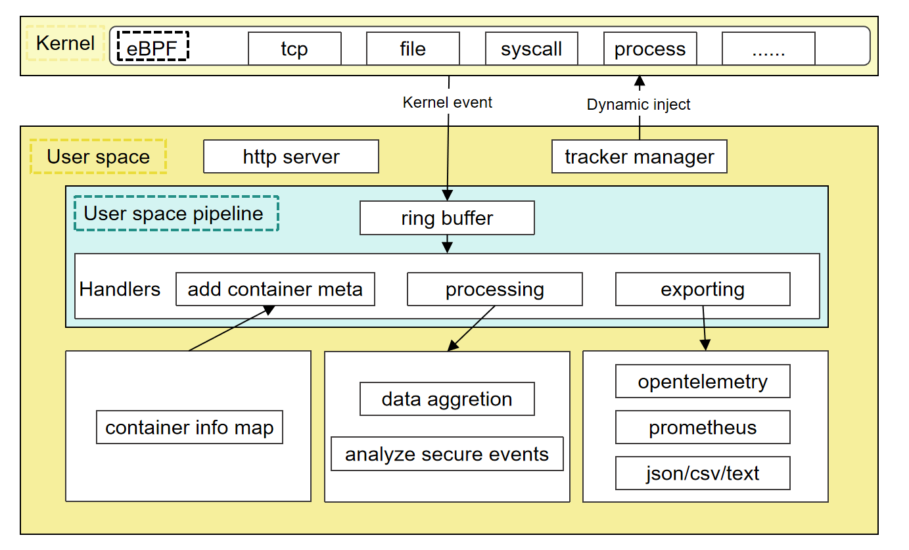

通过五类探针实现全维度数据采集，采用 “内核态捕获 + 用户态处理” 架构，支持独立线程运行与动态启停：
- 进程探针：基于sched_process_exec/sched_process_exit tracepoint，捕获进程 PID、命令行、容器元信息等，用户态支持多格式输出。
- 系统调用探针：通过raw_syscalls/sys_enter tracepoint 记录调用号、参数，用户态可检测危险调用并告警。
- 文件探针：挂钩vfs_read/vfs_write，采集文件路径、读写数据，支持敏感文件过滤。
- 网络探针：追踪tcp_v4_connect/tcp_v6_connect，获取 IP、端口等，用户态提供 Prometheus 指标及多格式输出。
- IPC 探针：监控进程间通信（信号量、共享内存等），关联容器信息检测跨容器未授权通信。

### eBPF 数据处理模块
  
- 进程过滤模块：通过 三条件组合过滤 减少无效数据，只采集与容器安全、业务逻辑相关的进程事件，提升数据质量。
- 信息提取模块：从 eBPF 数据中提取关键信息，如进程元数据、系统调用参数、文件路径、网络连接信息等，为后续分析提供基础数据。
- 数据传送模块：采用环形缓冲区传输 eBPF 数据，用户态处理线程异步读取，避免数据丢失与阻塞。

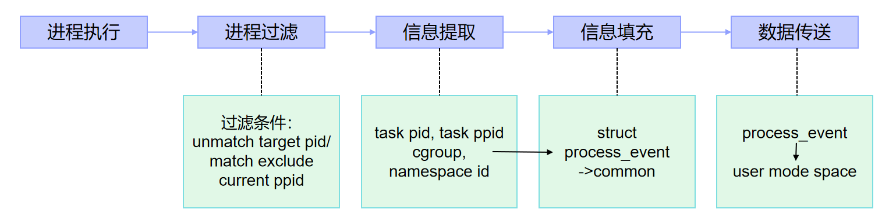

### 异常检测模块

- 规则引擎：预设敏感路径访问（如/etc/shadow）、特权进程创建等规则，触发即时告警；
- 统计引擎：基于滑动窗口分析资源指标波动，识别 CPU / 内存突增等异常；
- 机器学习引擎：通过 CSV 处理器将 eBPF 数据转换为特征向量，利用 Isolation Forest 模型检测离群点；

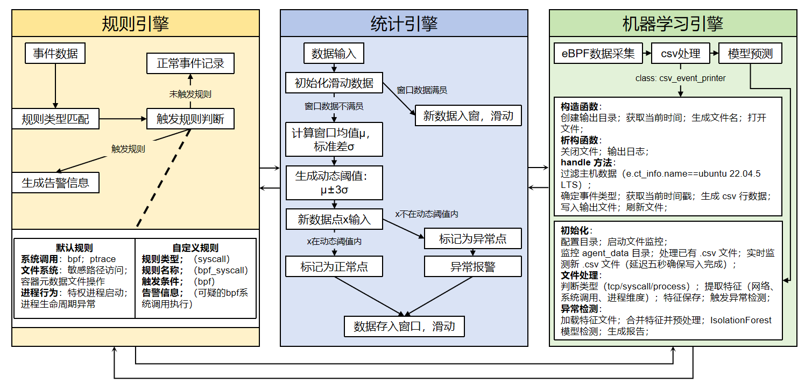

### 容器异常注入模块

- 异常类型：CPU 密集、内存泄漏、端口扫描、权限提升、文件系统滥用等≥12 类。
- 配置能力：通过injection_config.ini设置异常强度、持续时长、权重。
- 安全控制：启用资源限额（cpu_count、mem_limit）、自动清理与依赖回退机制，默认在隔离环境执行。
- 异常注入：在容器中模拟异常场景，触发异常事件，生成结构化标签数据。
- 数据输出：将异常数据与正常数据区分，输出带标签的 CSV 格式数据，用于模型训练与检测效果评测。

### 可视化与集成模块


- 集成 Prometheus 存储时序数据，自定义 Exporter 适配 eBPF 指标；

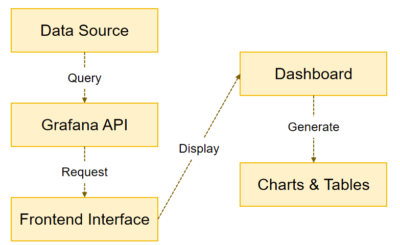

- Grafana 面板展示进程、系统调用频率、文件读写等指标，支持异常事件钻取分析。

## 技术栈

本项目使用了以下技术、框架和库：
- Linux eBPF
- Grafana
- Python/Go（用于数据处理和算法实现）
- Docker/Kubernetes（用于容器环境）

## 安装编译指南

### 配置要求

在编译之前，确保您的 Kconfig 包含以下选项：
```
CONFIG_DEBUG_INFO_BTF=y 
CONFIG_DEBUG_INFO=y
```
建议的内核版本为 5.10 或更高。如果使用较旧的内核版本，可能需要安装额外的 BTF 信息。
### 使用预编译的二进制文件

您可以使用我们预编译的二进制文件来启动 Agent 服务器：
```
sudo ./agent server
```
此命令将启用核心 eBPF 跟踪器，包括进程、TCP 和文件，同时启动安全引擎以检测潜在的安全问题。


该命令将在默认间隔 3 秒内跟踪系统中所有文件的读取或写入，并输出结果：
```
[2025-06-26 07:20:10.853] [info] pid    container_name reads  writes read_bytes write_bytes type   comm         filename    
[2025-06-26 07:20:10.854] [info]  43535 ubuntu          1      0         23          0 R      ps           pid_max     
[2025-06-26 07:20:10.854] [info]   1182 ubuntu          0      2          0        440 R      dockerd      072ab609040fb96f9d1ba3b8a1d9586bfb4ae6f474067efad12b462f9e1548f3-json.log
[2025-06-26 07:20:10.854] [info]  41064 ubuntu          2      0        731          0 R      prometheus   stat        
[2025-06-26 07:20:10.854] [info]  41064 ubuntu          2      0        731          0 R      prometheus   stat        
[2025-06-26 07:20:10.854] [info]  41064 ubuntu          2      0        731          0 R      prometheus   stat        
[2025-06-26 07:20:10.854] [info]  42835 ubuntu          0      4          0        806 R      SaveScripts  urlCache-new.bin
[2025-06-26 07:20:10.854] [info]  43535 ubuntu          1      0        832          0 R      ps           libgpg-error.so.0.32.1
[2025-06-26 07:20:10.854] [info]  43535 ubuntu          1      0        832          0 R      ps           libcap.so.2.44
[2025-06-26 07:20:10.854] [info]  43535 ubuntu          1      0        832          0 R      ps           libgcrypt.so.20.3.4
[2025-06-26 07:20:10.854] [info]  43537 ubuntu          1      0        832          0 R      cpuUsage.sh  libtinfo.so.6.3
[2025-06-26 07:20:10.854] [info]  43535 ubuntu          1      0        832          0 R      ps           libsystemd.so.0.32.0
[2025-06-26 07:20:10.854] [info]  43538 ubuntu          1      0        832          0 R      sed          libacl.so.1.1.2301
[2025-06-26 07:20:10.854] [info]  43546 ubuntu          1      0        832          0 R      sed          libselinux.so.1
[2025-06-26 07:20:10.854] [info]  43546 ubuntu          1      0        832          0 R      sed          libacl.so.1.1.2301
[2025-06-26 07:20:10.854] [info]  43535 ubuntu          1      0        832          0 R      ps           libzstd.so.

```

## 使用 Docker 部署 Prometheus 和 Grafana

### 快速启动

1. 构建并运行Agent Docker镜像：
```
cd quickstart
sudo docker build -t agent:v0.1 .
sudo docker run -it --rm --privileged -p 9090:9090 agent:v0.1 /bin/bash
```
### 部署 Prometheus
1. 拉取 Prometheus 镜像：
```
sudo docker pull prom/prometheus
```
2. 配置 Prometheus：
```
cp ./prometheus.yml /etc/prometheus/prometheus.yml
```
3. 运行 Prometheus 容器：
```
./prometheus-2.53.0.linux-amd64/prometheus --config.file=prometheus.yml --web.listen-address="0.0.0.0:9090" &
./agent server --config test.toml &
```

### 切换终端
```
cd quickstart
```

### 部署 Grafana

1. 拉取 Grafana 镜像：
```
sudo docker pull grafana/grafana:latest
```
2. 运行 Grafana 容器：
```

sudo apt-get install -y adduser libfontconfig1
wget https://dl.grafana.com/enterprise/release/grafana-enterprise_8.5.4_amd64.deb
sudo dpkg -i grafana-enterprise_8.5.4_amd64.deb
sudo /bin/systemctl start grafana-server
```
3. 访问 Grafana 界面
```

默认情况下，Grafana 运行在 3000 端口。您可以通过 http://localhost:3000 访问 Grafana 界面。
```
### Prometheus和Grafana运行结果

#### tcp 连接延时

#### http的请求与响应

#### grafana ：内存分配与使用

#### 文件读写数据信息
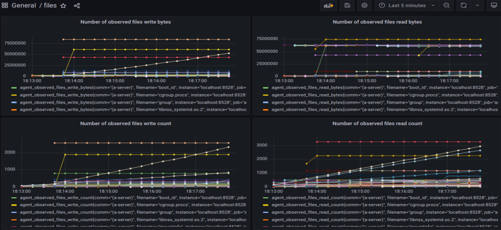
#### 进程信息
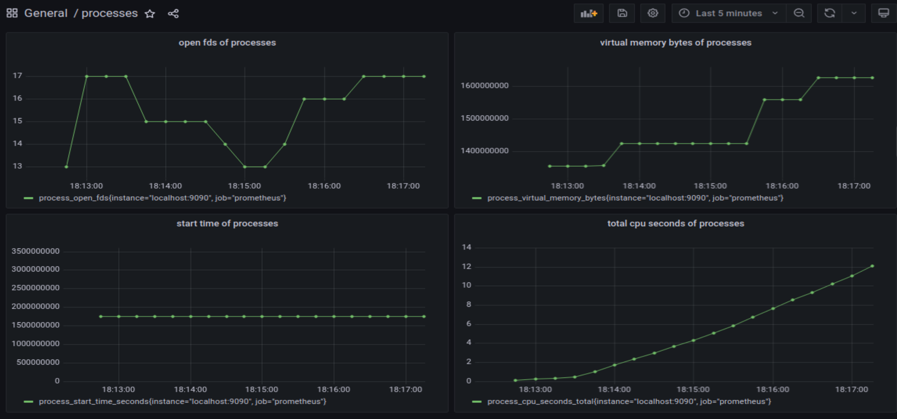
#### 系统调用信息
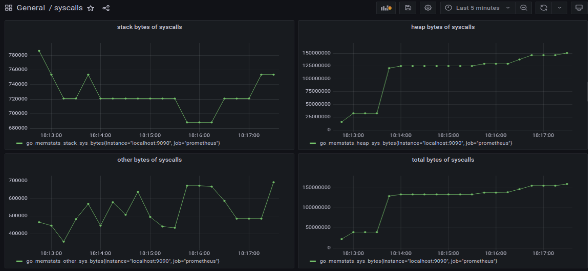

## 功能测试与验证

### AI模型编译训练
1. 生成工具
```
make generate-tools
```
2.  配置编译环境
```
CC=gcc-10 CXX=g++-10 cmake -Bbuild -Dagent_ENABLE_UNIT_TESTING=0 -Dagent_USE_GTEST=0
```
3.  创建目录并复制文件
```
mkdir -p build/libbpf/ && cp bpftools/process/.output/libbpf/libbpf.a build/libbpf/libbpf.a
```
4.  编译构建项目
```
cmake --build build --config Release
```

### 容器异常注入

1.  进入异常注入目录
```
cd container_injector
```
2. 启动容器异常注入（Bash 版，总 40 个容器，异常占比 20%，运行 10 分钟）
```
bash ./container_injector.sh
```
3. 高级 Python 版（支持自定义异常类型与强度
```
python3 container_anomaly_injector.py

```

### 异常注入验证
- 这里我们以Bash 版一键部署为例分析，Bash 版一键部署会启动40个容器，异常占比20%，运行10分钟。
#### 启动容器异常注入
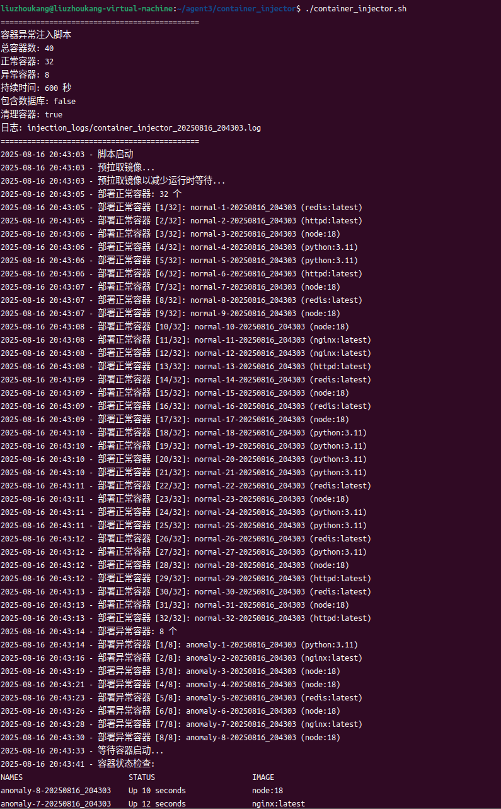
#### 异常检测告警结果
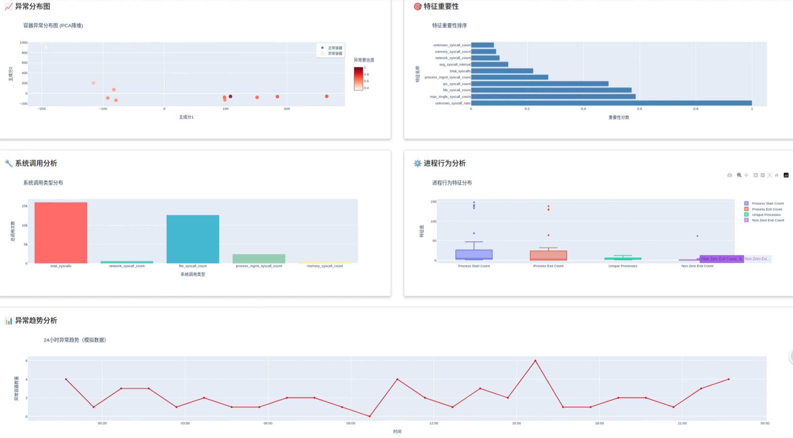
- 容器异常分布图
这个分布图通过 PCA（主成分分析） 将高维特征压缩到二维空间，直观区分正常容器和 异常容器。异常点（橙色部分）分散在正常点（蓝色部分）外围，说明异常模式多样；离正常集群越远的异常点，行为偏离度可能越高。
- 特征重要性排序
这一重要性分布图是通过机器学习模型计算特征对异常判定的贡献度得出的，我们可以看到特征重要性的排序，以此来锁定容器发生异常的关键问题。图中process_exit_count（即进程退出次数）、max_syscall_count（即最大系统调用数）等特征排名靠前，说明 进程稳定性、系统调用频率 是异常检测的核心维度。可优先针对高重要性特征设置阈值。
- 系统调用分析   
该统计图统计 total_syscalls（总调用）、network_syscall_count（网络调用）、file_syscall_count（文件调用）等类型的占比。在这里total_syscalls 占比最高，file_syscall_count 次之，network_syscall_count 最少，反映文件操作是系统调用的主要场景。若某类调用占比突然飙升，可能是出现了异常。
- 进程行为分析
这里通过箱线图展示 Process Start Count（即启动次数）、Process Exit Count（即退出次数）、Unique Processes（即唯一进程数）、Non Zero Exit Count（即异常退出次数）的分布。箱线图的 outliers（即离群点）代表异常值（如某容器的 Process Start Count 远高于正常范围，可能是进程频繁重启）。Non Zero Exit Count 若出现离群点，则直接指向进程崩溃风险。
- 异常趋势分析
这是本项目基于机器学习进行容器异常检测的关键优势所在。我们可以根据当前收集到的容积异常数据，预测未来24小时之内的异常容器数量趋势。
#### 容器异常相关矩阵

    这个矩阵图展示了容器异常相关矩阵，红色和蓝色区域分别对应指标的正、负相关关系。紧凑红区表明模型成功捕捉到真实物理系统的关联规律，符合容器资源联动的客观事实。同时蓝区位置符合预期（如网络与磁盘的互斥关系），证明未在特征工程中丢失重要竞争关系信号。容器的异常往往伴随多个指标波动。由以上相关矩阵可发现强相关的指标对（如 “容器 CPU 使用率” 和 “宿主机 CPU 负载” 高度正相关），异常时这些指标可能同步异常，帮助快速关联分析；若异常时某些强相关指标 “背离”（如本该正相关的指标突然负相关），可能是异常信号。弱相关信号反之。长期监测相关矩阵的变化，识别 “相关性突变”（如原本弱相关的指标突然强相关），可以作为异常预警信号。

#### 归一化
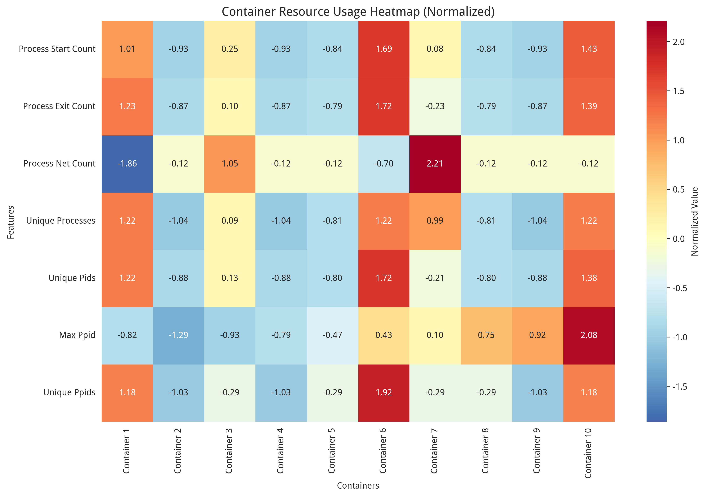
这是容器进程行为的归一化热力图，用于对比不同容器在进程相关特征上的表现差异，核心作用是定位异常容器的进程行为模式。横轴对应不同的容器，纵轴对应容器的各项进程相关指标。图中每个单元格的颜色表示该容器在该指标上的归一化值，颜色越浅表示值越大，颜色越深表示值越小。容器的每种指标都有相应的正常范围区间，我们可以根据单元格上的异常值与正常范围区间的对比得出容器发生异常的行为特征，从而推断发生异常的原因。
## 兼容性

Agent支持以下操作系统和环境：
- Linux
- Docker/Kubernetes

## 依赖关系

项目运行所需的依赖项包括：
- Linux内核版本 >= 4.18（支持eBPF）
- Python/Go（用于算法实现）
- Prometheus/Grafana（用于数据展示）

## Benchmark

为了评估Agent的性能，我们使用了以下基准测试方法：

### 使用 top 查看内存和CPU占用情况

通过 top 命令查看系统在运行Agent时的内存和CPU占用情况。


### 环境设置

在虚拟机上启动一个容器和负载相均衡的网络服务，使用 Prometheus 和 Grafana 进行监控，并使用 wrk 进行压力测试。

测试环境配置如下：
- 操作系统：Linux ubuntu 5.13.0-44-generic #49~22.04.1-Ubuntu SMP x86_64 GNU/Linux
- 硬件配置：4 核 CPU，4 GB 内存


### 测试过程

#### 未开启Agent的情况

首先，在未启动Agent的情况下进行测试，获得基线性能数据：


#### 启动Agent后的情况

接下来，启动Agent，并启用默认配置中的 process/container、tcp、files、ipc 等探针，在相同的环境下再次进行测试：


### 结果分析

可以观测到，启动Agent之后，服务的性能损耗仅约为 2%。这表明，Agent在提供全面监控和安全检测的同时，对系统资源的占用非常低，不会显著影响系统的整体性能。

## 参考文献

[1]eBPF. https://ebpf.io/

[2]bpf performance tools. https://github.com/iovisor/bcc

[3]BPF reference guide. https://docs.cilium.io/en/stable/bpf/

[4]Falco. https://falco.org/docs/getting-started/

[5]Zou Z, Xie Y, Huang K, et al. A docker container anomaly monitoring system based on optimized isolation forest[J]. IEEE Transactions on Cloud Computing, 2019, 10(1): 134-145.

[6]Zhang J, Chen P, He Z, et al. Real-Time Intrusion Detection and Prevention with Neural Network in Kernel Using eBPF[C]//2024 54th Annual IEEE/IFIP International Conference on Dependable Systems and Networks (DSN). IEEE, 2024: 416-428.

[7]libbpf. https://github.com/libbpf/libbpf/tree/libbpf-v1.0.1

[8]Chaos Mesh. https://chaos-mesh.org/zh/docs/production-installation-using-helm/