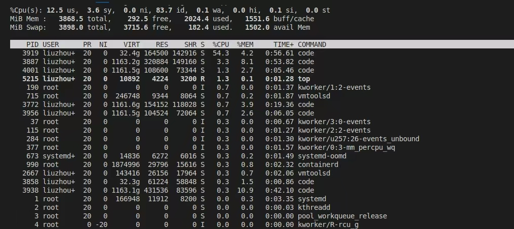
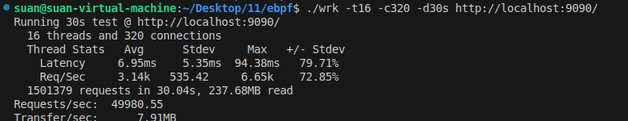
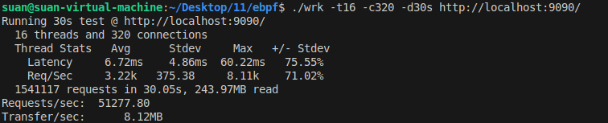

# ContriSage

## 简介

常见的容器异常检测方法包括基于统计的算法、基于规则的算法、基于人工智能的算法等。本项目综合这些方法的优势，采用基于 eBPF 的容器异常检测技术，构建了轻量化、高性能的容器异常检测框架ContriSage。

ContriSage 通过 Linux eBPF 技术在运行时监控容器行为与系统指标，实时收集进程生命周期、系统调用、文件操作、网络连接等细粒度数据，结合多维度异常检测模型识别可疑行为。其核心优势在于内核级观测能力，可突破传统用户态监控的局限性，适配容器高动态性与隔离性特点。

ContriSage 具备性能分析、容器集群网络可视化、安全告警、一键部署等功能，核心二进制文件仅 4MB，支持 Linux 内核≥5.10 环境，可无缝集成 Prometheus、Grafana 等云原生工具。

此外，ContriSage 支持容器异常注入功能，可模拟 CPU 密集、内存泄漏、端口扫描等≥12 类异常场景，形成 “注入→采集→检测→告警→报告” 的闭环评测链路，为模型优化与功能验证提供标准化测试基准。
## 优势与特点

- 内核级动态观测：基于 eBPF 技术实现内核态直接数据采集，覆盖进程、系统调用、文件、网络等关键观测点，数据延迟降至毫秒级，解决短生命周期容器追踪难题。
- 轻量化与可扩展性：核心 ContriSage运行时 CPU 占用≤5%、内存≤120MB，性能损耗≤2%；支持动态加载 / 卸载 eBPF 探针，可按需扩展监控维度。
- 多维度异常检测：融合三层检测模型
规则引擎：基于安全基线（如敏感文件访问、危险系统调用）实时告警；
统计分析：识别资源指标突增 / 突减等异常波动；
机器学习：采用 Isolation Forest 无监督算法，适配容器动态特性，检测高维时序数据中的未知异常。
- 容器异常注入能力：提供场景化异常库，支持强度、时长配置，可生成带标签数据，用于模型训练与检测效果评测，确保对宿主影响可控。
- 实时告警与通知：采用实时告警机制，及时发现异常情况并通知相关人员。同时，支持自定义告警规则，满足不同场景的需求。
- 云原生深度集成： 支持 Prometheus 时序数据存储、Grafana 可视化展示，适配 Docker、Kubernetes 环境，支持跨节点容器统一管理。

## 技术栈

本项目使用了以下技术、框架和库：
- Linux eBPF
- Grafana
- Python/Go（用于数据处理和算法实现）
- Docker/Kubernetes（用于容器环境）

## 安装编译指南

### 配置要求

在编译之前，确保您的 Kconfig 包含以下选项：
```
CONFIG_DEBUG_INFO_BTF=y 
CONFIG_DEBUG_INFO=y
```
建议的内核版本为 5.10 或更高。如果使用较旧的内核版本，可能需要安装额外的 BTF 信息。
### 使用预编译的二进制文件

您可以使用我们预编译的二进制文件来启动 ContriSage 服务器：
```
sudo ./agent server
```
此命令将启用核心 eBPF 跟踪器，包括进程、TCP 和文件，同时启动安全引擎以检测潜在的安全问题。


该命令将在默认间隔 3 秒内跟踪系统中所有文件的读取或写入，并输出结果：
```
[2025-06-26 07:20:10.853] [info] pid    container_name reads  writes read_bytes write_bytes type   comm         filename    
[2025-06-26 07:20:10.854] [info]  43535 ubuntu          1      0         23          0 R      ps           pid_max     
[2025-06-26 07:20:10.854] [info]   1182 ubuntu          0      2          0        440 R      dockerd      072ab609040fb96f9d1ba3b8a1d9586bfb4ae6f474067efad12b462f9e1548f3-json.log
[2025-06-26 07:20:10.854] [info]  41064 ubuntu          2      0        731          0 R      prometheus   stat        
[2025-06-26 07:20:10.854] [info]  41064 ubuntu          2      0        731          0 R      prometheus   stat        
[2025-06-26 07:20:10.854] [info]  41064 ubuntu          2      0        731          0 R      prometheus   stat        
[2025-06-26 07:20:10.854] [info]  42835 ubuntu          0      4          0        806 R      SaveScripts  urlCache-new.bin
[2025-06-26 07:20:10.854] [info]  43535 ubuntu          1      0        832          0 R      ps           libgpg-error.so.0.32.1
[2025-06-26 07:20:10.854] [info]  43535 ubuntu          1      0        832          0 R      ps           libcap.so.2.44
[2025-06-26 07:20:10.854] [info]  43535 ubuntu          1      0        832          0 R      ps           libgcrypt.so.20.3.4
[2025-06-26 07:20:10.854] [info]  43537 ubuntu          1      0        832          0 R      cpuUsage.sh  libtinfo.so.6.3
[2025-06-26 07:20:10.854] [info]  43535 ubuntu          1      0        832          0 R      ps           libsystemd.so.0.32.0
[2025-06-26 07:20:10.854] [info]  43538 ubuntu          1      0        832          0 R      sed          libacl.so.1.1.2301
[2025-06-26 07:20:10.854] [info]  43546 ubuntu          1      0        832          0 R      sed          libselinux.so.1
[2025-06-26 07:20:10.854] [info]  43546 ubuntu          1      0        832          0 R      sed          libacl.so.1.1.2301
[2025-06-26 07:20:10.854] [info]  43535 ubuntu          1      0        832          0 R      ps           libzstd.so.

```

## 使用 Docker 部署 Prometheus 和 Grafana

### 快速启动

1. 构建并运行ContriSage Docker镜像：
```
cd quickstart
sudo docker build -t agent:v0.1 .
sudo docker run -it --rm --privileged -p 9090:9090 agent:v0.1 /bin/bash
```
### 部署 Prometheus
1. 拉取 Prometheus 镜像：
```
sudo docker pull prom/prometheus
```
2. 配置 Prometheus：
```
cp ./prometheus.yml /etc/prometheus/prometheus.yml
```
3. 运行 Prometheus 容器：
```
./prometheus-2.53.0.linux-amd64/prometheus --config.file=prometheus.yml --web.listen-address="0.0.0.0:9090" &
./agent server --config test.toml &
```

### 切换终端
```
cd quickstart
```

### 部署 Grafana

1. 拉取 Grafana 镜像：
```
sudo docker pull grafana/grafana:latest
```
2. 运行 Grafana 容器：
```
sudo apt-get install -y adduser libfontconfig1
wget https://dl.grafana.com/enterprise/release/grafana-enterprise_8.5.4_amd64.deb
sudo dpkg -i grafana-enterprise_8.5.4_amd64.deb
sudo /bin/systemctl start grafana-server
```

### AI模型编译训练
1. 生成工具
```
make generate-tools
```
2.  配置编译环境
```
CC=gcc-10 CXX=g++-10 cmake -Bbuild -Dagent_ENABLE_UNIT_TESTING=0 -Dagent_USE_GTEST=0
```
3.  创建目录并复制文件
```
mkdir -p build/libbpf/ && cp bpftools/process/.output/libbpf/libbpf.a build/libbpf/libbpf.a
```
4.  编译构建项目
```
cmake --build build --config Release
```

### 容器异常注入

1.  进入异常注入目录
```
cd container_injector
```
2. 启动容器异常注入（Bash 版，总 40 个容器，异常占比 20%，运行 10 分钟）
```
bash ./container_injector.sh
```
3. 自定义 Python 版（支持自定义异常类型与强度）
```
python3 container_anomaly_injector.py
```

## 兼容性

ContriSage支持以下操作系统和环境：
- Linux
- Docker/Kubernetes

## 依赖关系

项目运行所需的依赖项包括：
- Linux内核版本 >= 4.18（支持eBPF）
- Python/Go（用于算法实现）
- Prometheus/Grafana（用于数据展示）

## Benchmark

为了评估ContriSage的性能，我们使用了以下基准测试方法：

### 使用 top 查看内存和CPU占用情况

通过 top 命令查看系统在运行ContriSage时的内存和CPU占用情况。


### 环境设置

在虚拟机上启动一个容器和负载相均衡的网络服务，使用 Prometheus 和 Grafana 进行监控，并使用 wrk 进行压力测试。

测试环境配置如下：
- 操作系统：Linux ubuntu 5.13.0-44-generic #49~22.04.1-Ubuntu SMP x86_64 GNU/Linux
- 硬件配置：4 核 CPU，4 GB 内存


### 测试过程

#### 未开启ContriSage的情况

首先，在未启动ContriSage的情况下进行测试，获得基线性能数据：



#### 启动ContriSage后的情况

接下来，启动ContriSage，并启用默认配置中的 process/container、tcp、files、ipc 等探针，在相同的环境下再次进行测试：



### 结果分析

可以观测到，启动ContriSage之后，服务的性能损耗仅约为 2%。这表明，ContriSage在提供全面监控和安全检测的同时，对系统资源的占用非常低，不会显著影响系统的整体性能。

## 参考文献

[1]eBPF. https://ebpf.io/

[2]bpf performance tools. https://github.com/iovisor/bcc

[3]BPF reference guide. https://docs.cilium.io/en/stable/bpf/

[4]Falco. https://falco.org/docs/getting-started/

[5]Zou Z, Xie Y, Huang K, et al. A docker container anomaly monitoring system based on optimized isolation forest[J]. IEEE Transactions on Cloud Computing, 2019, 10(1): 134-145.

[6]Zhang J, Chen P, He Z, et al. Real-Time Intrusion Detection and Prevention with Neural Network in Kernel Using eBPF[C]//2024 54th Annual IEEE/IFIP International Conference on Dependable Systems and Networks (DSN). IEEE, 2024: 416-428.

[7]libbpf. https://github.com/libbpf/libbpf/tree/libbpf-v1.0.1

[8]Chaos Mesh. https://chaos-mesh.org/zh/docs/production-installation-using-helm/
