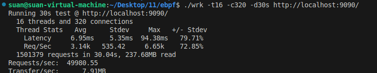
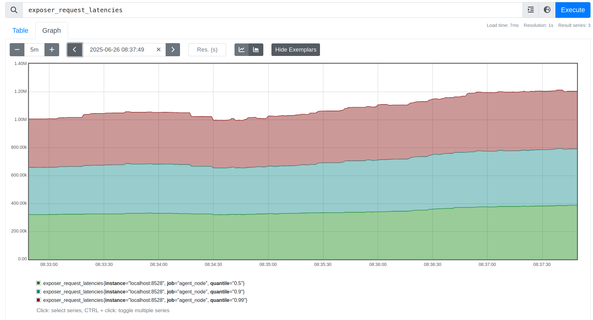
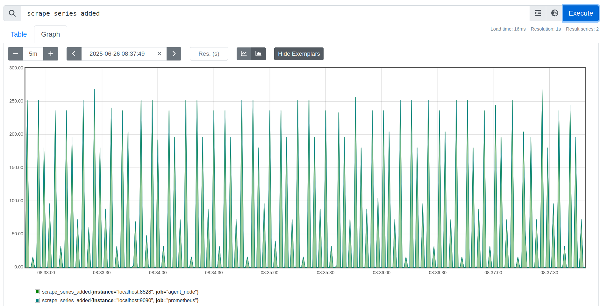
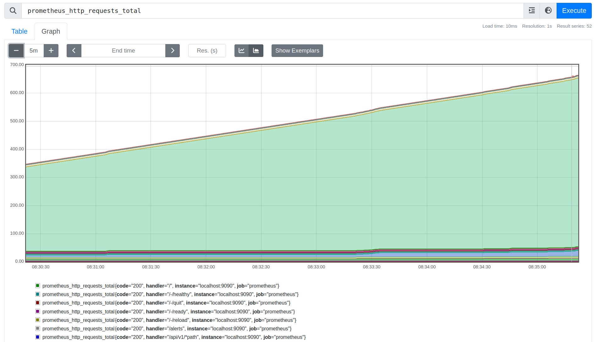
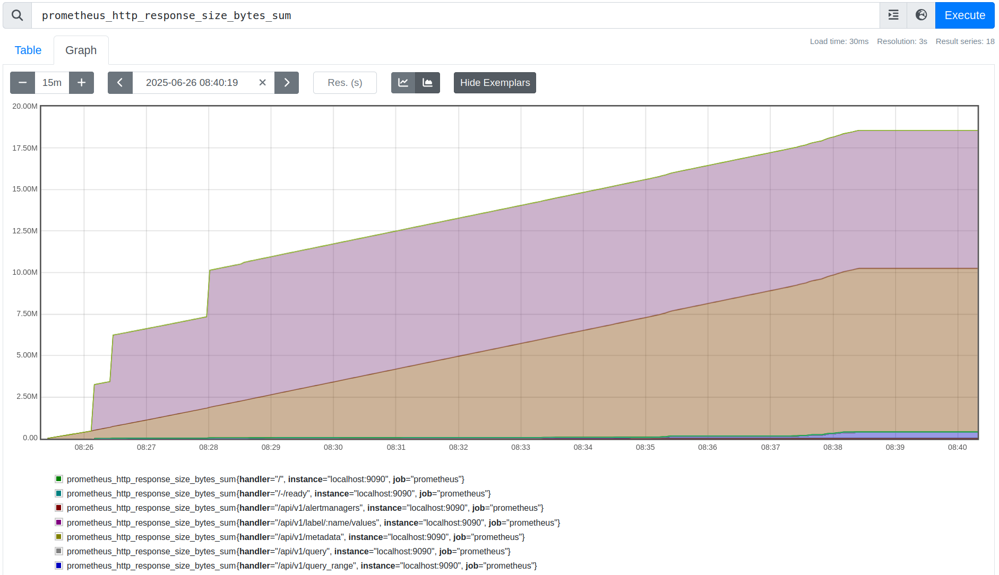
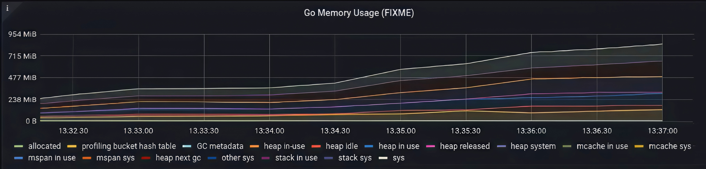

# 操作系统大赛：基于 eBPF 的容器监控工具初赛报告

基于 eBPF 的轻量级 CloudNative Monitor 工具，用于容器安全性和可观察性

## 1. 目录
<!-- TOC -->

- [1. 目录](#1-目录)
- [2. 项目目标](#2-项目目标)
- [3. 比赛题目分析和相关资料调研](#3-比赛题目分析和相关资料调研)
  - [3.1. 题目描述](#31-题目描述)
  - [3.2. 赛题分析](#32-赛题分析)
  - [3.3. 相关资料调研](#33-相关资料调研)
    - [3.3.1. ebpf](#331-ebpf)
    - [3.3.2. ebpf 开发工具技术选型](#332-ebpf-开发工具技术选型)
    - [3.3.3. Eunomia](#333-Eunomia)
    - [3.3.4. 异常检测算法 Isolation Forest](#334-异常检测算法-Isolation-Forest)
    - [3.3.5. 容器可观测性](#335-容器可观测性)
    - [3.3.6. 信息可视化展示](#336-信息可视化展示)
    - [3.3.7. 容器运行时安全](#337-容器运行时安全)
- [4. 系统框架设计](#4-系统框架设计)
  - [4.1. 总体框架设计](#41-总体框架设计)
  - [4.2. 模块设计](#42-模块设计)
  - [4.3. ebpf 主要观测点](#43-ebpf-主要观测点)
  - [4.4. ebpf 探针设计](#44-ebpf-探针设计)
    - [4.4.1. ebpf 探针相关 C 代码设计，以 process 为例：](#441-ebpf-探针相关-c-代码设计以-process-为例)
    - [4.4.2. C++ 部分探针代码设计](#442-c-部分探针代码设计)
    - [4.4.3. handler 相关事件处理代码](#443-handler-相关事件处理代码)
  - [4.5. 容器元信息模块设计](#45-容器元信息模块设计)
    - [4.5.1. 容器信息数据结构](#451-容器信息数据结构)
    - [4.5.2. 容器追踪实现](#452-容器追踪实现)
  - [4.6. 安全规则设计](#46-安全规则设计)
  - [4.7. seccomp: syscall准入机制](#47-seccomp-syscall准入机制)
- [5. 难点与创新点](#5-难点与创新点)
  - [5.1. 如何设计 ebpf 挂载点](#51-如何设计-ebpf-挂载点)
  - [5.2. 如何进行内核态数据过滤和数据综合](#52-如何进行内核态数据过滤和数据综合)
  - [5.3. 如何定位容器元信息](#53-如何定位容器元信息)
  - [5.4. 如何设计支持可扩展性的数据结构](#54-如何设计支持可扩展性的数据结构)
- [6. 项目测试](#6-项目测试)
    - [6.1. 性能测试](#61-性能测试)
    - [6.2. 功能验证](#62-功能验证)
- [7. 提交仓库目录和文件描述](#7-提交仓库目录和文件描述)
  - [7.1. 项目仓库目录结构](#71-项目仓库目录结构)
- [8. 开发计划-重要进展-分工协作](#8-开发计划-重要进展-分工协作)
  - [8.1. 开发计划](#81-开发计划)
  - [8.2. 未来的工作方向](#82-未来的工作方向)
  - [8.3. 分工协作](#83-分工协作)
  - [8.4. 比赛收获](#84-比赛收获)
    - [8.4.1. 刘周康同学](#841-刘周康同学)
    - [8.4.2. 容器追踪实现](#842-容器追踪实现)
    - [8.4.3. 容器追踪实现](#843-容器追踪实现)
- [9. 参考资料](#9-参考资料)
<!-- /TOC -->

## 2. 项目目标
Agent项目旨在构建一个基于eBPF的容器异常检测框架，通过实时监控容器行为特征和性能指标，结合人工智能算法自动识别异常容器。核心目标包括：
- **提升容器安全性**：实时检测容器内异常行为（如可疑进程、异常文件操作）
- **优化系统性能**：分析性能瓶颈（如TCP延迟、文件I/O效率）
- **简化运维管理**：提供一键部署、Prometheus/Grafana集成和HTTP API远程控制
- **实现轻量化部署**：核心二进制文件仅需4MB，支持Linux内核≥5.10

## 3. 比赛题目分析和相关资料调研
### 3.1 题目描述
容器环境的大规模高动态性，为运行其中的微服务造成了安全隐患。容器生命周期短，频繁创建和销毁，导致环境变化迅速，而传统的静态配置管理和监控方法难以适应这种高度动态的环境。现代应用通常由多个微服务组成，每个微服务可能运行在多个容器实例上，形成庞大的集群，大规模的容器部署增加了管理和监控的复杂度。eBPF作为内核跟踪和网络分析的新兴技术，在容器异常检测领域，eBPF可以为容器提供内核级的安全监控，不仅可以提高监测效率，而且能够从监测对象中挖取更精细的容器运行时特征。相比于现有成熟的基于用户态的异常检测技术，eBPF可以有效降低开销。如何在降低开销的同时，突破eBPF本身在内存等方面的受限条件，针对容器运行时特征设计完成一个基于eBPF的容器异常监测方法仍是一个挑战。

本项目要求基于eBPF设计并开发一个内核级的容器异常智能检测框架，基于该框架实现如CPU、内存、网络等容器资源指标的提取分析方法，如基于系统调用上下文的时序分析方法，并结合各种异常检测方法，实现基于机器学习的容器运行时异常检测。

**第一题**：设计并开发一个针对容器运行时数据的采集框架（如系统调用、容器各项资源指标、网络监控数据），数据类型不限，但要求基于eBPF在内核处理跟踪点数据。

**第二题**：设计并实现容器异常行为的自动检测算法，包括不限于基于规则的算法、基于统计的算法和基于机器学习的算法。

**第三题**：利用grafana、Prometheus等工具进行数据异常展示，形成分析报告。

**第四题(可选)**：采集框架具有使用不同类型数据采集工具的能力，可集成多种用户态采集工具供选择，并支持各类工具的性能比较。

**第五题(可选)**：系统具备自我调整能力，能根据实际环境动态调整其异常检测过程，以达到最优检测效果。

### 3.2 赛题分析
本赛题分为三个部分，第一部分为编写ebpf程序，来抓取到容器运行时的各项数据，这一部分的关键点在于找到合适的ebpf程序挂载点。挂载点确定后我们可以使用现有的各种ebpf	开发框架编写开发代码，以此来完成此部分任务。第二部分容器异常行为检测，则首先需要我们将内核态捕捉到的数据传递到用户态，然后在用户态进行输出。而在完成了数据传输之后，我们则需要基于规则、基于统计以及基于机器学习来设计我们检测容器异常的算法。第三部分数据的存储与可视化，我们设计将程序捕获到的数据使用 Prometheus 进行存储，之后对于存储的数据我们使用 Grafana 进行可视化，这样子我们借助这两个工具就实现了数据监控、数据统计和告警功能。

### 3.3 相关资料调研
#### 3.3.1 ebpf
eBPF（Extended Berkeley Packet Filter）代表了一种突破性的内核级可编程范式，它从根本上改变了系统监控和安全防护的实现方式。这项技术允许开发者在无需修改内核源代码或加载传统内核模块的前提下，直接在Linux内核的安全沙盒环境中执行定制化程序。这种设计理念将内核转变为可编程的基础设施层，使得原本需要复杂分层实现的系统监控、网络优化和安全防护等任务，现在可以直接在内核层面高效完成。

- 技术本质与核心价值

    eBPF的核心创新在于它建立了一个安全的内核执行环境。通过严格的验证机制，eBPF程序在加载前必须通过数百项安全检查，包括内存边界验证、循环检测和资源访问权限控制等。这种设计既保证了内核的稳定性，又提供了前所未有的灵活性。当应用于容器监控场景时，eBPF能够直接访问cgroup和namespace等容器核心技术提供的资源视图，这解决了传统监控方案在容器化环境中面临的三个关键挑战：短生命周期容器的追踪难题、监控代理部署的安全风险，以及跨容器攻击行为的检测盲区。

    在性能优化方面，eBPF展现出显著优势。以内核原生指令运行的eBPF程序避免了传统用户态监控工具（如strace）频繁的上下文切换开销，通过JIT（Just-In-Time）编译技术将字节码实时转换为宿主架构的机器码，其执行效率接近原生内核函数。在云原生环境的实际测试中，eBPF的资源消耗仅为传统监控代理的1/10（CPU占用<1%，内存<5MB），这使其成为高密度容器部署场景的理想选择。

- 细粒度观测能力

    eBPF的观测能力跨越多个维度，从进程级监控到函数级追踪均可实现。例如通过kprobe挂载点，可以精确捕获容器内进程的文件访问行为：
    ```c
    SEC("kprobe/__x64_sys_open")
    int trace_file_open(struct pt_regs *ctx) {
        char filename[256];
        bpf_probe_read_user_str(filename, sizeof(filename), PT_REGS_PARM1(ctx));
        bpf_printk("Container file access: %s", filename);
        return 0;
    }
    ```
    这种能力使开发者能够构建立体化的监控视图，同步关联系统调用、网络数据包和调度事件等多源数据。在容器安全场景中，这种细粒度观测特别有价值——既能检测可疑的文件访问模式，又能关联容器的网络通信行为，为异常检测提供丰富的上下文信息。

-  实际应用与挑战应对

    在容器安全领域，eBPF已展现出不可替代的价值。其内核态的事件捕获机制完美适配容器的动态特性，无需在容器内部部署任何代理即可实时追踪进程生命周期。当检测到跨网络命名空间的异常流量模式时，eBPF能精准定位潜在的容器间攻击行为，这是传统基于用户态的监控方案难以实现的。

    然而，eBPF技术在实际部署中也面临特定挑战。其对较新内核版本（≥5.10）的依赖可能成为老旧系统的障碍。针对这一限制，当前主流解决方案包括：通过BTF（BPF Type Format）兼容层支持4.18+内核的有限功能，或采用容器化部署隔离内核版本依赖。此外，eBPF编程的学习曲线较为陡峭，需要开发者深入理解内核C编程、验证器规则和Map机制。为降低门槛，社区已发展出libbpf-bootstrap等开发框架，以及bpftrace等高级脚本工具，使开发者能更高效地构建eBPF解决方案。

#### 3.3.2 ebpf 开发工具技术选型

原始的eBPF程序编写是非常繁琐和困难的。为了改变这一现状，llvm于2015年推出了可以将由高级语言编写的代码编译为eBPF字节码的功能，同时，其将 bpf() 等原始的系统调用进行了初步地封装，给出了 libbpf 库。这些库会包含将字节码加载到内核中的函数以及一些其他的关键函数。在Linux的源码包的 samples/bpf/ 目录下，有大量Linux提供的基于 libbpf 的eBPF样例代码。一个典型的基于libbpf 的eBPF程序具有*_kern.c 和*_user.c 两个文件，*_kern.c 中书写在内核中的挂载点以及处理函数，*_user.c 中书写用户态代码，完成内核态代码注入以及与用户交互的各种任务。
然而由于该方法仍然较难理解且入门存在一定的难度，因此现阶段的eBPF程序开发大多基于一些工具，比如：

- BCC
- BPFtrace
- libbpf
- go-libbpf
- etc

目前使用较多的是 BCC 工具，但本项目放弃了 BCC ，选择了 libbpf 作为我们的开发工具。

BCC 全称为 BPF Compiler Collection ，是一个python库，包含了完整的编写、编译、和加载 BPF 程序的工具链，以及用于调试和诊断性能问题的工具。自2015年发布以来，BCC 经过上百位贡献者地不断完善后，目前已经包含了大量随时可用的跟踪工具。并且 其官方项目库 提供了一个方便上手的教程，用户可以快速地根据教程完成 BCC 入门工作。用户可以在 BCC 上使用Python、Lua等高级语言进行编程。

相较于使用C语言直接编程，这些高级语言具有极大的便捷性，用户只需要使用C来设计内核中的 BPF 程序，其余包括编译、解析、加载等工作在内，均可由 BCC 完成。

然而使用 BCC 存在一个缺点便是在于其兼容性并不好。基于 BCC 的 eBPF 程序每次执行时候都需要进行编译，编译则需要用户配置相关的头文件和对应实现。在实际应用中，相信大家也会有体会，编译依赖问题是一个很棘手的问题。也正是因此，在本项目的开发中我们放弃了BCC，选择了可以做到一次编译-多次运行的 libbpf 工具。

libbpf-bootstrap 是一个基于 libbpf 库的BPF开发脚手架，从其 github 上可以得到其源码。 libbpf-bootstrap 综合了BPF社区过去多年的实践，为开发者提了一个现代化的、便捷的工作流，实现了一次编译，重复使用的目的。

基于 libbpf 的BPF程序在编译时会先将 *.bpf.c 文件编译为对应的.o文件，然后根据此文件生成 skeleton 文件，即 *.skel.h ，这个文件会包含内核态中定义的一些数据结构，以及用于装载内核态代码的关键函数。在用户态代码 include 此文件之后调用对应的装载函数即可将字节码装载到内核中。
我们选择现代 C++ 语言（cpp20）开发 Agent 的时候也主要是看中和 libbpf 库以及 bpf 代码的良好兼容性，libbpf 库目前还在迅速更新迭代过程中，我可以直接基于 libbpf 库进行开发，不需要被其他语言（go/rust）的运行时 bpf 库所限制。现代 C++ 的开发速度和安全性应该并不会比其他语言差太多（要是编译提示能像 rust 那样好点就更好了，用了 concept 还是不够好）

#### 3.3.3 Eunomia

我们的项目是在Eunomia的基础上进行二次开发的。[Eunomia](https://yunwei37.github.io/Eunomia/) 是一个使用 C/C++ 开发的基于 eBPF的轻量级，高性能云原生监控工具框架，旨在帮助用户了解容器的各项行为、监控可疑的容器安全事件，力求提供覆盖容器全生命周期的轻量级开源监控解决方案。


它使用 Linux eBPF 技术在运行时跟踪您的系统和应用程序，并分析收集的事件以检测可疑的行为模式。目前，它包含性能分析、容器集群网络可视化分析、容器安全感知告警、一键部署、持久化存储监控等功能，提供了多样化的 ebpf 追踪点，并可以轻松拓展。其核心导出器/命令行工具最小仅需要约 4MB 大小的二进制程序，即可在支持的 Linux 内核上启动。

Eunomia 的不足之处在于异常检测的逻辑过于简单，同时对于抓取的数据没有任何的处理，这一定程度上影响了异常处理的效率。

本项目在 Eunomia 的基础上，添加了基于规则，基于人工智能，基于统计的异常检测算法，并补充了在容器运行中抓取的数据，增添了新的监控指标，同时在容器运行时实时检测异常行为，并通过告警机制及时通知用户。同时，由于抓取的数据过多，我们对数据采取了过滤，这可以大大减少数据量，同时也可以减少计算量，从而提高效率，降低损耗。

#### 3.3.4 异常检测算法 Isolation Forest

在容器异常检测领域，基于机器学习的算法因其能够学习复杂模式并检测未知异常而备受关注。Isolation Forest (IForest) 作为一种高效的无监督异常检测算法，特别适用于本项目中对容器运行时异常（如资源滥用、可疑进程行为、异常网络连接）的识别。以下是针对 IForest 的详细调研：

1. **核心原理**：
- “隔离”而非“建模”正常： IForest 的核心思想与基于密度或距离的传统方法不同。它不试图对“正常”数据的分布进行建模，而是专注于快速隔离异常点。

- 随机划分与路径长度： 算法通过递归地随机选择特征和划分值来构建多棵“隔离树”(iTree)。在每棵 iTree 中：

    - 异常点：通常具有与正常点显著不同的特征值组合，因此能被较少的随机划分（较短的路径长度）隔离到树的叶节点。

    - 正常点：则倾向于更均匀地分布在特征空间，需要更多的随机划分（更长的路径长度）才能被完全隔离。

- 异常分数： 给定一个数据点，计算其在所有 iTree 中的平均路径长度。平均路径长度越短，该点越有可能是异常。异常分数 s 被定义为 s(x, n) = 2^(-E(h(x))/c(n))，其中 E(h(x)) 是 x 在所有树中路径长度的期望，c(n) 是给定样本数 n 时的平均路径长度归一化因子。s 接近 1 表示很可能是异常，接近 0 表示很可能是正常点。

2. **关键优势**：
- 无监督学习： 无需预先标记异常数据即可进行训练，非常适合容器环境这种异常样本稀少且定义可能模糊的场景。

- 计算效率高： 算法复杂度接近线性 (O(n log n))，并且对内存需求相对较低。这使得它能够高效处理 eBPF 采集的海量、高维时序数据（如系统调用序列、资源指标时间序列）。这与本项目“轻量化部署”和“降低开销”的目标高度契合。

- 擅长高维数据： 基于随机特征划分的特性使其在高维特征空间中表现依然稳健，不易受“维数灾难”的严重影响。容器监控涉及 CPU、内存、网络、文件、进程等多维度指标，IForest 能有效处理这种复杂性。

- 对局部异常敏感： 特别擅长检测全局稀疏分布或局部聚集的异常点，这类异常在容器安全事件（如某个容器突发性资源耗尽、某个进程出现罕见调用模式）中很常见。

- 参数较少，易于调优： 主要参数是树的数量 (n_estimators) 和子采样大小 (max_samples)。参数敏感性相对较低，易于配置和部署。

3. **在容器异常检测中的适用性**：
- 资源指标异常： 检测容器 CPU 使用率突增/突降、内存泄漏、网络流量异常（远高于/低于同类容器基线）。IForest 可以学习容器在正常运行状态下的多指标联合分布模式，快速识别偏离此模式的异常容器。

- 系统调用/行为异常： 分析容器内进程的系统调用序列特征（如调用频率、类型分布、参数模式）。异常的进程行为（如提权操作序列、敏感文件访问模式）通常会产生与众不同的调用序列，能被 IForest 基于路径长度识别出来。这直接服务于“提升容器安全性”的目标。

- 网络连接异常： 检测异常的连接目标（非常规IP/端口）、连接频率或流量模式。结合 eBPF 提供的精细网络监控能力（TCP 连接延迟、重传率），IForest 可识别潜在的扫描、C&C 通信等恶意网络活动。

- 处理容器动态性： IForest 训练速度快，可以周期性地使用新采集的“正常”数据更新模型，适应容器环境频繁创建销毁带来的基线变化。这为项目的“自我调整能力”（可选目标）提供了可行的算法基础。

4. **与 eBPF 数据采集的结合**：
- 特征工程： eBPF 在内核态高效采集的原始事件数据（如系统调用号、文件路径、网络元组、资源指标值）需要经过用户态预处理，转换成适合 IForest 输入的数值型特征向量。例如：

    - 将时序指标（如 1 秒内的 CPU 使用率、网络包数量）聚合为统计特征（均值、方差、最大值、最小值）。

    - 对系统调用事件进行编码（如特定调用类型的计数、调用序列的 n-gram 频率）。

    - 将容器元信息（ID, Name）作为分组标识或辅助特征。

- 在线/近线检测： 训练好的 IForest 模型可以部署在用户态数据流水线中。eBPF 程序将实时或近实时采集的数据推送到用户态，经过特征提取后输入 IForest 模型进行异常评分。得分超过阈值的容器或事件可触发告警或记录到分析报告中。

- 低开销闭环： IForest 的高效性确保了在 eBPF 已经显著降低数据采集开销的基础上，后续的异常分析环节不会成为新的性能瓶颈，共同实现整个框架的轻量化目标。

#### 3.3.5 容器可观测性

容器环境的可观测性面临着独特的双重挑战：瞬时生命周期与命名空间隔离的叠加效应。容器平均存活时间不足3小时，这种高动态性导致传统轮询式监控难以捕捉关键异常事件。与此同时，PID、Network、Mount等多层命名空间构成的隔离屏障，使常规观测工具无法穿透容器边界获取完整视图。在微服务架构中，这种挑战尤为显著——单次服务请求可能跨越多个容器实例，形成复杂的调用拓扑，而现有的监控方案往往缺乏跨容器事件关联能力。

在技术实现层面，容器监控的核心在于建立有效的进程-容器映射机制。当前主流方案通过Linux内核的eBPF技术在task_storage映射表中维护实时关联关系。当cgroup_attach_task事件触发时，系统直接在内核态捕获容器标识，避免了传统方案通过/proc文件系统轮询产生的秒级延迟。这种设计使得进程创建事件与容器归属能够实现毫秒级同步，从根本上解决了短生命周期容器的追踪盲区。在实际生产环境中，Docker生态主要依赖/var/run/docker.sock接口获取容器元数据，而更通用的CRI方案则通过运行时接口获取Pod沙箱信息，形成互补的技术路线。

从行业实践来看，容器监控正在经历三个维度的技术演进。在数据采集层，混合监控架构逐渐成为主流方案——AWS FireLens通过eBPF与控制平面双通道采集，在5000+容器实例规模下仍保持200ms以内的日志路由延迟；在数据分析层，基于LSTM的预测模型已能提前15分钟预警内存泄漏风险，将异常进程检测准确率提升至92.7%；在标准协议层，OpenTelemetry v1.27新增的容器冷启动时延监测等规范，正推动行业形成统一观测指标体系。值得注意的是，eBPF技术已成为突破容器隔离限制的关键支撑，其在内核层直接处理容器事件的能力，使监控数据采集精度提升了一个数量级。

#### 3.3.6 信息可视化展示
Prometheus 是一套开源的监控、报警、时间序列数据库的组合，受启发于Google的Brogmon监控系统，2012年开始由前Google工程师在Soundcloud以开源软件的形式进行研发，并且于2015年早期对外发布早期版本。2016年，Prometheus 加入了云计算基金会，成为 kubernetes 之后的第二个托管项目。其架构如下所示:

<div  align="center">  
 
 <p>Prometheus架构</p>
</div>

Prometheus具有以下特点：

- 可以自定义多维数据模型并且使用metric和

- 存储高效，不依赖分布式存储，支持单节点工作

- 使用灵活且强大的查询语言 PromQL 

- 通过基于http的pull方式采集时许数据

- 通过push gateway进行序列数据推送

Grafana 是一款用Go语言开发的开源数据可视化工具，具有数据监控、数据统计和告警功能，是目前较为流行的一种时序数据展示工具，并且支持目前绝大部分常用的时序数据库。

在本项目中，我们计划将程序捕获到的数据使用 Prometheus 进行存储，之后对于存储的数据我们使用 Grafana 进行可视化

#### 3.3.7 容器运行时安全
容器运行时环境面临多维度的安全挑战：

1. **进程行为风险**

    - 恶意进程创建

    - 特权容器逃逸

2. **文件系统脆弱点**

    - 敏感目录遍历

    - 配置文件未授权篡改

3. **网络攻击面**

    - 隐蔽C&C通信

    - 横向移动行为

4. **供应链威胁**

    - 恶意镜像注

## 4. 系统框架设计

### 4.1 总体框架设计

总体框架图如下，该框架图介绍了本项目构建的监控系统的总体框架，包括容器层、采集层、告警层和展示层。该系统能够实现在容器层进行容器环境监控及自动化部署，在采集层采集监控到的数据，并统一数据格式，在告警层使用相关算法处理告警，在展示层进行前后端通信与前端展示。

<div  align="center">  
 
 <p>总体框架</p>
</div>

### 4.2 模块设计

- tracker_manager

    - start tracker

    - stop tracker(remove tracker)

    负责启动和停止 ebpf 探针，并且和 ebpf 探针通信（每个 tracer 是一个线程）；

    我们主要有五个ebpf探针:

    - process

    - syscall

    - tcp

    - files

    - ipc

    除此以外我们还集成了大量来自于BCC等开源工具中的追踪器，包括oomkill, memleak等。

- container_manager

    负责观察 container 的启动和停止，保存每个 container 的相关信息：（cgroup，namespace），同时负责 container id, container name 等 container mata 信息到 pid 的转换（提供查询接口）

- seccomp_manager

    负责对 process 进行 seccomp 限制

- handler/data collector
    
    负责处理 ebpf 探针上报的事件

- security analyzer
    
    容器安全检测规则引擎和安全分析模块，通过ebpf采集到的底层相关数据，运用包括AI在内的多种方法进行安全性分析，可以帮助您检测事件流中的可疑行为模式。

- prometheus exporter

    将数据导出成Prometheus需要的格式，在Prometheus中保存时序数据，方便后续持久化和可视化功能。

- config loader

    解析 toml

- cmd
   
    命令行解析模块，将命令行字符串解析成对应的参数选项，对Agent进行配置。

- core

    负责装配所需要的 tracker，配置对应的功能用例，并且启动系统。

- server

    http 通信：通过 graphql 在远程发起 http 请求并执行监控工具，将产生的数据进行聚合后返回，用户可自定义运行时扩展插件进行在线数据分析。这一个部分还没有完成。

### 4.3. ebpf 主要观测点

- rocess追踪模块

    进程的追踪模块本项目主要设置了两个 tracepoint 挂载点。 第一个挂载点形式为

    ```c
    SEC("tp/sched/sched_process_exec")
    int handle_exec(struct trace_event_raw_sched_process_exec *ctx)
    {

    }
    ```

    当进程被执行时，该函数会被调用，函数体中会从传入的上下文内容提取内容，我们需要的信息记录在Map中。 第二个挂载点形式为

    ```c
    SEC("tp/sched/sched_process_exit")
    int handle_exit(struct trace_event_raw_sched_process_template *ctx)
    {
        
    }
    ```

    当有进程退出时，该函数会被调用，函数体同样会从传入的上下文内容提取内容，我们需要的信息记录在Map中。

- syscall追踪模块

    对于系统调用的追踪模块设置了一个 tracepoint 挂载点。挂载点形式为

    ```c
    SEC("tracepoint/raw_syscalls/sys_enter")
    int sys_enter(struct trace_event_raw_sys_enter *args)
    {

    }
    ```

    当有syscall发生时，其经过sys_enter执行点时我们的函数将会被调用，将相关信息存入map后供用户态读取。

- file追踪模块

    对于文件系统，我们设置了两个 kprobe 挂载点。第一个挂载点形式为

    ```c
    SEC("kprobe/vfs_read")
    int BPF_KPROBE(vfs_read_entry, struct file *file, char *buf, size_t count, loff_t *pos)
    {

    }
    ```

    第二个挂载点形式为

    ```c
    SEC("kprobe/vfs_write")
    int BPF_KPROBE(vfs_write_entry, struct file *file, const char *buf, size_t count, loff_t *pos)
    {

    }
    ```

    当系统中发生了文件读或写时，这两个执行点下的函数会被触发，记录相应信息。

- tcp追踪模块

    ```c
    SEC("kprobe/tcp_v6_connect")
    int BPF_KPROBE(tcp_v6_connect, struct sock *sk) {
        return enter_tcp_connect(ctx, sk);
    }

    SEC("kretprobe/tcp_v6_connect")
    int BPF_KRETPROBE(tcp_v6_connect_ret, int ret) {
        return exit_tcp_connect(ctx, ret, 6);
    }
    ```

### 4.4 ebpf 探针设计

采用 ebpf 探针的方式，可以获取到安全事件的相关信息，并且可以通过 prometheus 监控指标进行监控和分析。

我们的探针代码分为两个部分，其一是在 bpftools 中，是针对相关 ebpf 程序的 libbpf 具体探针接口实现，负责1ebpf 程序的加载、配置、以及相关用户态和内核态通信的代码；另外一部分是在 src 中，针对 ebpf 探针上报的信息进行具体处理的 C++ 类实现，负责根据配置决定ebpf上报的信息将会被如何处理。

#### 4.4.1 ebpf 探针相关 C 代码设计，以 process 为例：

process 部分的代码主要负责获取进程的执行和退出时和进程相关的以下的信息：

- pid

- cgroup

- namespace：user pid mount

- ppid

- command

- 可执行文件路径

其中容器相关信息会保存起来并被其他 tracker 用以查询。

ebpf 代码：在 bpftools\process\process.bpf.c 中，这里贴出来的代码经过了一定程度的化简。

```c
static __always_inline void fill_event_basic(pid_t pid, struct task_struct *task, struct process_event *e)
{
	e->common.pid = pid;
	e->common.ppid = BPF_CORE_READ(task, real_parent, tgid);
	e->common.cgroup_id = bpf_get_current_cgroup_id();
	e->common.user_namespace_id = get_current_user_ns_id();
	e->common.pid_namespace_id = get_current_pid_ns_id();
	e->common.mount_namespace_id = get_current_mnt_ns_id();
}


SEC("tp/sched/sched_process_exec")
int handle_exec(struct trace_event_raw_sched_process_exec *ctx)
{
	struct task_struct *task;
	unsigned fname_off;
	struct process_event *e;
	pid_t pid;
	u64 ts;

	/* remember time exec() was executed for this PID */
	pid = bpf_get_current_pid_tgid() >> 32;
	if (target_pid && pid != target_pid)
		return 0;
	ts = bpf_ktime_get_ns();
	bpf_map_update_elem(&exec_start, &pid, &ts, BPF_ANY);

	/* reserve sample from BPF ringbuf */
	e = bpf_ringbuf_reserve(&rb, sizeof(*e), 0);
	if (!e)
		return 0;

	/* fill out the sample with data */
	task = (struct task_struct *)bpf_get_current_task();
	if (exclude_current_ppid) {
		if (exclude_current_ppid == BPF_CORE_READ(task, real_parent, tgid)) {
			return 0;
		}
	}
	fill_event_basic(pid, task, e);

	bpf_get_current_comm(&e->comm, sizeof(e->comm));
	e->exit_event = false;
	fname_off = ctx->__data_loc_filename & 0xFFFF;
	bpf_probe_read_str(e->filename, sizeof(e->filename), (void *)ctx + fname_off);

	/* successfully submit it to user-space for post-processing */
	bpf_ringbuf_submit(e, 0);
	return 0;
}
```

这部分是负责处理进程执行的代码，通过挂载点 tp/sched/sched_process_exec 来监测所有的进程执行和退出相关情况。其中包含了对进程的相关信息的获取，以及对进程的相关信息的填充。具体进程相关的信息会被放到这个结构体中，并传递给 C++ 编写的处理程序：
bpftools\process\process.h

```c
struct common_event {
	int pid;
	int ppid;
	uint64_t cgroup_id;
	uint32_t user_namespace_id;
	uint32_t pid_namespace_id;
	uint32_t mount_namespace_id;
};

struct process_event
{
	struct common_event common;

	unsigned exit_code;
	unsigned long long duration_ns;
	char comm[TASK_COMM_LEN];
	char filename[MAX_FILENAME_LEN];
	bool exit_code;
};
```

C++ 部分通过 start_process_tracker 函数来加载 process 相关 ebpf 探针，并且注册回调函数。以下是相关签名：
代码在 bpftools\process\process_tracker.h 中：

```c
static int start_process_tracker(
    ring_buffer_sample_fn handle_event,
    libbpf_print_fn_t libbpf_print_fn,
    struct process_env env,
    struct process_bpf *skel,
    void *ctx);
```

每个 ebpf 探针会被当做一个独立的线程运行，这个线程会被放到一个单独的线程池中，这样就可以保证每个 ebpf 探针都是独立的进程：

- 我们可以在同一个二进制程序或者进程中同时运行多个探针，例如可以同时运行 process 和 tcp，通过 process 获取的容器元信息，以 pid 作为主键来查询 tcp 每个连接相关的容器信息。

- 探针可以在 agent 运行的任意时刻被启动，也可以在任意时刻被关闭。

- 同一种类型的探针可以被运行多个实例，比如来监测不同的 cgroups 或者不同的进程。
这样设计的目的是，例如如果我们需要进行在线的监控数据获取和分析，可以通过远端的 http 请求，让 agent 往内核中注入一个 ebpf 探针，运行 30 秒后停止该探针，然后通过 graphql 请求，通过外界数据库或者内置的算子进行数据聚合，之后返回获取的数据指标。这样的好处是可以不用在任何时候都必须运行某些代价高昂的监控服务（例如 syscall 监控），极大地节省相关服务器资源，避免干扰正常的服务运行。

每个探针有两个重要的数据结构， event 和 env。event 上报给用户态的信息结构体， env是对应的 tracker 的配置：

```c
struct process_env
{
  bool verbose;
  pid_t target_pid;
  pid_t exclude_current_ppid;
  long min_duration_ms;
  volatile bool *exiting;
};
```

C++ 部分的代码会在调用 start_process_tracker 之前设置好对应的 env 信息，来控制 ebpf 代码的相关行为。

#### 4.4.2 C++ 部分探针代码设计

我们采用类似责任链的设计模式，通过一系列的回调函数和事件处理类来处理 ebpf 上报的内核事件：

- 每个 ebpf 探针都是一个单独的类

- 每个探针类都可以有数量不限的事件处理 handler 类（例如转换成 json 类型，上报给prometheus，打印输出，保存文件，进行聚合等），它们通过类似链表的方式组织起来，并且可以在运行被动态组装；

以 process 为例，c++部分的探针代码如下：
see: include\agent\process.h

```c
// ebpf process tracker interface
// the true implementation is in process/process_tracker.h
//
// trace process start and exit
struct process_tracker : public tracker_with_config<process_env, process_event>
{
  using config_data = tracker_config<process_env, process_event>;
  using tracker_event_handler = std::shared_ptr<event_handler<process_event>>;

  process_tracker(config_data config);

  // create a tracker with deafult config
  static std::unique_ptr<process_tracker> create_tracker_with_default_env(tracker_event_handler handler);

  process_tracker(process_env env);
  // start process tracker
  void start_tracker();

  // used for prometheus exporter
  struct prometheus_event_handler : public event_handler<process_event>
  {
    prometheus::Family<prometheus::Counter> &agent_process_start_counter;
    prometheus::Family<prometheus::Counter> &agent_process_exit_counter;
    void report_prometheus_event(const struct process_event &e);

    prometheus_event_handler(prometheus_server &server);
    void handle(tracker_event<process_event> &e);
  };

  // convert event to json
  struct json_event_handler_base : public event_handler<process_event>
  {
    std::string to_json(const struct process_event &e);
  };

  // used for json exporter, inherits from json_event_handler
  struct json_event_printer : public json_event_handler_base
  {
    void handle(tracker_event<process_event> &e);
  };
  
  // used for print to console
  struct plain_text_event_printer : public event_handler<process_event>
  {
    void handle(tracker_event<process_event> &e);
  };
  
};
```

这部分代码继承自 tracker_base，每个 ebpf 探针的代码都会继承自 tracker_base 和 tracker_with_config:
include\agent\model\tracker.h

```c
// the base type of a tracker
// for tracker manager to manage
struct tracker_base
{
  // base thread
  std::thread thread;
  volatile bool exiting;
  // TODO: use the mutex
  std::mutex mutex;

 public:
  virtual ~tracker_base()
  {
    exiting = true;
    if (thread.joinable())
    {
      thread.join();
    }
  }
  virtual void start_tracker(void) = 0;
  void stop_tracker(void)
  {
    exiting = true;
  }
};

// all tracker should inherit from this class
template<typename ENV, typename EVENT>
struct tracker_with_config : public tracker_base
{
  tracker_config<ENV, EVENT> current_config;
  tracker_with_config(tracker_config<ENV, EVENT> config) : current_config(config)
  {
  }
};
```

分成两个类设计的目的是为了同时完成运行时多态编译期多态。其中 tracker_config 是对应的模板类，包含了探针的配置信息和处理事件的 handler，比如：
include\agent\model\tracker_config.h

```c
// config data for tracker
// pass this to create a tracker
template <typename ENV, typename EVENT>
struct tracker_config
{   
    // tracker env in C code
    ENV env;
    std::string name;
    // event handler interface
    std::shared_ptr<event_handler<EVENT>> handler = nullptr;
};
```

每个 ebpf 探针类都要满足对应的 concept，比如：
include\agent\model\tracker.h

```c
// concept for tracker
// all tracker should have these types
template<typename TRACKER>
concept tracker_concept = requires
{
  typename TRACKER::config_data;
  typename TRACKER::tracker_event_handler;
  typename TRACKER::prometheus_event_handler;
  typename TRACKER::json_event_printer;
  typename TRACKER::plain_text_event_printer;
};
```

这个 concept 规定了 tracker 必须要实现的 handler ，以及需要有的子类型。

#### 4.4.3 handler 相关事件处理代码

每个探针类都可以有数量不限的事件处理 handler 类（例如转换成 json 类型，上报给 prometheus，打印输出，保存文件，进行聚合等），它们通过类似链表的方式组织起来，并且可以在运行被动态组装；

- ebpf 上报的 event 会按顺序被 handler 处理，如果 handler 返回 false，则 event 不会被后续的 handler 处理，否则会一直被处理到最后一个 handler（捕获机制）；

- 上报的 event 可以被转换成不同的类型，即可以做聚合操作，也可以从 event 结构体转换成 json 类型；

- 多个不同的 ebpf 探针可以把 event 发送给同一个 handler，例如将文件访问信息和 process 执行信息合并成一个 event，获取每个文件访问的进程的 docker id，docker name，然后发送给 prometheus；

- handler 同样可以用来匹配对应的安全规则，在出现可能的安全风险的时候执行告警操作；

例如，上面所描述的 process 类就有对应的 handler：

- prometheus_event_handler;

- json_event_printer;

- plain_text_event_printer;

我们的安全风险分析和安全告警也可以基于对应的handler 实现，例如：
include\agent\sec_analyzer.h

```c
// base class for securiy rules
template<typename EVNET>
struct rule_base : event_handler<EVNET>
{
  std::shared_ptr<sec_analyzer> analyzer;
  rule_base(std::shared_ptr<sec_analyzer> analyzer_ptr) : analyzer(analyzer_ptr) {}
  virtual ~rule_base() = default;

  // return rule id if matched
  // return -1 if not matched
  virtual int check_rule(const tracker_event<EVNET> &e, rule_message &msg) = 0;
  void handle(tracker_event<EVNET> &e)
  {
      if (!analyzer)
      {
        std::cout << "analyzer is null" << std::endl;
      }
      struct rule_message msg;
      int res = check_rule(e, msg);
      if (res != -1)
      {
        analyzer->report_event(msg);
      }
  }
};
```

handler 的具体实现在 include\agent\model\event_handler.h 中。

我们设计了有多种类型的 handler，并通过模板实现：

- 接受单一线程的事件，并且把同样的事件传递给下一个handler，只有一个 next handler；（事件传递）

- 接受单一线程的事件，并且把不同的事件传递给下一个handler，只有一个 next handler；（类型转换，如做聚合操作）

- 接受单一线程的事件，并且把不同的事件传递给下一个handler，可以有多个 next handler；（多线程传递）

- 接受多个线程传递的事件，并且把事件传递给下一个handler，只有一个 next handler；这部分需要有多线程同步，可以用无锁队列实现；

所有的 handler 都继承自 event_handler_base，它规定了 handler 接受的事件类型：
include\agent\model\event_handler.h

```c
template <typename T>
struct event_handler_base
{
public:
    virtual ~event_handler_base() = default;
    virtual void handle(tracker_event<T> &e) = 0;
    virtual void do_handle_event(tracker_event<T> &e) = 0;
};
```

对于第一类的 handler，也是我们目前最经常用到的事件处理程序，它的模板如下：
```c
template <typename T>
struct event_handler : event_handler_base<T>
{
// ptr for next handler
std::shared_ptr<event_handler_base<T>> next_handler = nullptr;
public:
    virtual ~event_handler() = default;

    // implement this function to handle the event
    virtual void handle(tracker_event<T> &e) = 0;

    // add a next handler after this handler
    std::shared_ptr<event_handler<T>> add_handler(std::shared_ptr<event_handler<T>> handler)
    {
        next_handler = handler;
        return handler;
    }
    // do the handle event
    // pass the event to next handler
    void do_handle_event(tracker_event<T> &e)
    {   
        bool is_catched = false;
        try {
           is_catched = handle(e);
        } catch (const std::exception& error) {
            std::cerr << "exception: " << error.what() << std::endl;
            is_catched = true;
        }
        if (!is_catched && next_handler)
            next_handler->do_handle_event(e);
        return;
    }
};
```

例如 prometheus_event_handler，它就继承自 event_handler 类。每个探针上报的 ebpf 事件都会被转换成 tracker_event 类型，然后传递给 event_handler event_handler 类的 handle 方法就是对事件进行处理，并且传递给下一个 handler：handler 被组织成为单链表的形式（也可以是树或者有向无环图的形式），这样就可以实现事件的传递.
其他类型的 handler 可以参考 include\agent\model\event_handler.h 文件。

### 4.5 容器元信息模块设计

#### 4.5.1 容器信息数据结构

目前我们的容器追踪模块是基于进程追踪模块实现的，其数据结构为：

```c
struct container_event {
	struct process_event process;
	unsigned long container_id;
	char container_name[50];
};
```

容器追踪模块由container_manager控制，其中会有负责向docker发送http请求的client，以及存储收集到的信息的map，以及对应的hanler函数。

```c
class container_manager
{
 public:
  /// use process tracker to track the processes created in the container
  class container_tracking_handler : public event_handler<process_event>
  {
    container_manager &manager;

   public:
    void handle(tracker_event<process_event> &e);
    container_tracking_handler(container_manager &m) : manager(m)
    {
    }
  };

  template<typename EVENT>
      // use process tracker to track the processes created in the container
      class container_info_handler : public event_handler<EVENT>
  {
    container_manager &manager;

   public:
    void handle(tracker_event<EVENT> &e)
    {
      if (e.data.pid == 0) {
        return;
      }
      // no container info; get it
      e.ct_info = manager.get_container_info_for_pid(e.data.pid);
    }
    container_info_handler(container_manager &m) : manager(m){};
  };

  container_manager();
  // init the container info table
  void init();
  // get container info using the pid in root namespace
  container_info get_container_info_for_pid(int pid) const;

 private:
  // container client for getting container info
  class container_client
  {
   private:
    // for dockerd http api
    httplib::Client dockerd_client;

   public:
    // get all container info json string
    std::string list_all_containers(void);
    // get container process by id
    std::string list_all_process_running_in_container(const std::string &container_id);
    // get container info by id
    std::string inspect_container(const std::string &container_id);
    container_info get_os_container_info(void);
    container_client();
  };

  // for datas store in the container_info_map
  struct process_container_info_data
  {
    common_event common;
    container_info info;
  };

  // used to store container info
  // thread safe
  class container_info_map
  {
   private:
    // use rw lock to protect the map
    mutable std::shared_mutex mutex_;
    // pid -> container info
    std::unordered_map<int, process_container_info_data> container_info_map__;

   public:
    container_info_map() = default;
    // insert a container info into the map
    void insert(int pid, process_container_info_data info)
    {
      std::unique_lock<std::shared_mutex> lock(mutex_);
      container_info_map__[pid] = info;
    }
    // get a container info from the map
    std::optional<process_container_info_data> get(int pid) const
    {
      std::shared_lock<std::shared_mutex> lock(mutex_);
      auto ct_info_p = container_info_map__.find(pid);
      if (ct_info_p != container_info_map__.end())
      {
        return ct_info_p->second;
      }
      return std::nullopt;
    }
    // remove a pid related container info from the map
    void remove(int pid)
    {
      std::unique_lock<std::shared_mutex> lock(mutex_);
      container_info_map__.erase(pid);
    }
  };

  container_info_map info_map;
  container_client client;

  // This is the default info for process not in the container
  container_info os_info;

  void get_all_process_info(void);
  // init the container info map for all running processes
  void update_container_map_data(void);
};
```

#### 4.5.2 容器追踪实现

容器追踪模块的ebpf代码服用了process追踪模块的ebpf代码，因此这里我们只介绍用户态下对数据处理的设计。
在追踪器启动之初，程序会调用update_container_map_data函数，该函数会向docker发送http请求，获得当前已经在运行的容器中函数信息。该函数实现如下所示：

```c
void container_manager::update_container_map_data(void)
{
  auto response = client.list_all_containers();
  json containers_json = json::parse(response);
  for (const auto c : containers_json)
  {
    container_info info = { c["Id"], c["Names"][0], container_status_from_str(c["State"]) };

    json process_resp = json::parse(client.list_all_process_running_in_container(info.id));
    for (const auto p : process_resp["Processes"])
    {
      int pid = std::atoi(std::string(p[1]).c_str());
      int ppid = std::atoi(std::string(p[2]).c_str());

      auto map_data = info_map.get(pid);
      if (map_data)
      {
        // update existing data with new container info
        map_data->common.pid = pid;
        map_data->common.ppid = ppid;
        map_data->info = info;
        info_map.insert(pid, *map_data);
      }
      else
      {
        auto common_e = get_process_common_event(pid);
        common_e.ppid = ppid;
        info_map.insert(pid, process_container_info_data{ common_e, info });
      }
    }
  }
}
```

当内核态捕捉到进程的数据返回到用户态时，程序会进入handle函数。其具体实现为：

```c
void container_manager::container_tracking_handler::handle(tracker_event<process_event>& e)
{
  if (e.data.exit_event)
  {
    // process exit;
    manager.info_map.remove(e.data.common.pid);
  }
  else
  {
    // process start;
    auto this_info = manager.info_map.get(e.data.common.pid);
    if (this_info)
    {
      // find the pid and update the map
      manager.info_map.insert(
          e.data.common.pid, process_container_info_data{ .common = e.data.common, .info = this_info->info });
      return;
    }

    // find ppid info
    int ppid = e.data.common.ppid;
    auto pp_info = manager.info_map.get(ppid);
    if (pp_info)
    {
      // reinsert the info from the parent process
      auto data = *pp_info;
      if (!(data.common == e.data.common))
      {
        // not same namespace, update container info.
        spdlog::info(
            "different namespace from parent process, update info for pid {} name {}.", e.data.common.pid, e.data.comm);
        manager.update_container_map_data();
      }
      data.common = e.data.common;
      manager.info_map.insert(e.data.common.pid, data);
      return;
    }
    // no parent info, no this info
    spdlog::info("No parent info and this pid container info: pid {} name {}", e.data.common.pid, e.data.comm);
    // no info, insert os info to the map
    manager.info_map.insert(
        e.data.common.pid, process_container_info_data{ .common = e.data.common, .info = manager.os_info });
    // add new info to ppid
    manager.info_map.insert(
        e.data.common.ppid, process_container_info_data{ get_process_common_event(e.data.common.ppid), manager.os_info });
  }
  e.ct_info = manager.get_container_info_for_pid(e.data.common.pid);
}
```

如果进程处于退出状态，那么我们会直接将其从map中删去。否则，我们会判断 该进程是否存在于map中，如果存在则更新其信息。不存在则去检查其父进程是否存在于map中。如果其父进程存在，那么我们会判断父进程和本进程的namespace等信息是否一致。不一致时我们会认为有可能新的容器已经出现，此时我们会继续调用update_container_map_data函数，对容器内的进程进行检查。如果的确存在新的进程则会将其更新进入map中。

### 4.6 安全规则设计
目前安全告警部分还未完善，只有一个框架和 demo，我们需要对更多的安全相关规则，以及常见的容器安全风险情境进行调研和完善，然后再添加更多的安全分析。

- 安全分析和告警

    目前我们的安全风险等级主要分为三类：

    ```c
    include\agent\sec_analyzer.h
    enum class sec_rule_level
    {
    event,
    warnning,
    alert,
    // TODO: add more levels?
    };
    ```

    安全规则和上报主要由 sec_analyzer 模块负责：

    ```c
    struct sec_analyzer
    {
    // EVNETODO: use the mutex
    std::mutex mutex;
    const std::vector<sec_rule_describe> rules;

    sec_analyzer(const std::vector<sec_rule_describe> &in_rules) : rules(in_rules)
    {
    }
    virtual ~sec_analyzer() = default;
    virtual void report_event(const rule_message &msg);
    void print_event(const rule_message &msg);

    static std::shared_ptr<sec_analyzer> create_sec_analyzer_with_default_rules(void);
    static std::shared_ptr<sec_analyzer> create_sec_analyzer_with_additional_rules(const std::vector<sec_rule_describe> &rules);
    };

    struct sec_analyzer_prometheus : sec_analyzer
    {
    prometheus::Family<prometheus::Counter> &agent_sec_warn_counter;
    prometheus::Family<prometheus::Counter> &agent_sec_event_counter;
    prometheus::Family<prometheus::Counter> &agent_sec_alert_counter;

    void report_prometheus_event(const struct rule_message &msg);
    void report_event(const rule_message &msg);
    sec_analyzer_prometheus(prometheus_server &server, const std::vector<sec_rule_describe> &rules);

    static std::shared_ptr<sec_analyzer> create_sec_analyzer_with_default_rules(prometheus_server &server);
    static std::shared_ptr<sec_analyzer> create_sec_analyzer_with_additional_rules(const std::vector<sec_rule_describe> &rules, prometheus_server &server);
    };
    ```

    我们通过 sec_analyzer 类来保存所有安全规则以供查询，同时以它的子类 sec_analyzer_prometheus 完成安全事件的上报和告警。具体的告警信息发送，可以由 prometheus 的相关插件完成，我们只需要提供一个接口。由于 rules 是不可变的，因此它在多线程读条件下是线程安全的。

- 安全规则实现

    我们的安全风险分析和安全告警规则基于对应的handler 实现，例如：

    include\agent\sec_analyzer.h

    ```c
    // base class for securiy rules
    template<typename EVNET>
    struct rule_base : event_handler<EVNET>
    {
    std::shared_ptr<sec_analyzer> analyzer;
    rule_base(std::shared_ptr<sec_analyzer> analyzer_ptr) : analyzer(analyzer_ptr) {}
    virtual ~rule_base() = default;

    // return rule id if matched
    // return -1 if not matched
    virtual int check_rule(const tracker_event<EVNET> &e, rule_message &msg) = 0;
    void handle(tracker_event<EVNET> &e)
    {
        if (!analyzer)
        {
        std::cout << "analyzer is null" << std::endl;
        }
        struct rule_message msg;
        int res = check_rule(e, msg);
        if (res != -1)
        {
        analyzer->report_event(msg);
        }
    }
    };
    ```

    这个部分定义了一个简单的规则基类，它对应于某一个 ebpf 探针上报的事件进行过滤分析，以系统调用上报的事件为例：

    ```c
    // syscall rule:
    //
    // for example, a process is using a dangerous syscall
    struct syscall_rule_checker : rule_base<syscall_event>
    {
    syscall_rule_checker(std::shared_ptr<sec_analyzer> analyzer_ptr) : rule_base(analyzer_ptr)
    {}
    int check_rule(const tracker_event<syscall_event> &e, rule_message &msg);
    };
    ```

    其中的 check_rule 函数实现了对事件进行过滤分析，如果事件匹配了规则，则返回规则的 id，否则返回 -1：关于 check_rule 的具体实现，请参考：src\sec_analyzer.cpp

    除了通过单一的 ebpf 探针上报的事件进行分析之外，通过我们的 handler 机制，我们还可以综合多种探针的事件进行分析，或者通过时序数据库中的查询进行分析，来发现潜在的安全风险事件。

- 人工智能实现

    除了通过规则来实现安全风险感知，我们还通过机器学习等方式进行进一步的安全风险分析和发现。
    我们基于IForest机器学习算法来实现容器异常检测：

    ```python
    agent/ai_train_iforest.py
    import pandas as pd
    from sklearn.ensemble import IsolationForest
    import joblib
    # 读取特征数据
    df = pd.read_csv('features.csv', header=None)
    X = df.values
    # 训练Isolation Forest
    model = IsolationForest(contamination=0.05, random_state=42)
    model.fit(X)
    # 保存模型
    joblib.dump(model, 'iforest_model.pkl')
    print("模型已保存到 iforest_model.pkl")
    ```

    ```python
    agent/ai_train_iforest.py
    import sys
    import joblib
    import json
    import numpy as np

    model = joblib.load('iforest_model.pkl')

    def predict(features):
        # features: dict
        X = np.array([[features[k] for k in sorted(features.keys())]])
        y_pred = model.predict(X)
        # IsolationForest: -1为异常，1为正常
        return int(y_pred[0] == -1)
    if __name__ == '__main__':
        features = json.loads(sys.argv[1])
    print(predict(features))
    ```

### 4.7 seccomp: syscall准入机制

Seccomp(全称：secure computing mode)在2.6.12版本(2005年3月8日)中引入linux内核，将进程可用的系统调用限制为四种：read，write，_exit，sigreturn。最初的这种模式是白名单方式，在这种安全模式下，除了已打开的文件描述符和允许的四种系统调用，如果尝试其他系统调用，内核就会使用SIGKILL或SIGSYS终止该进程。Seccomp来源于Cpushare项目，Cpushare提出了一种出租空闲linux系统空闲CPU算力的想法，为了确保主机系统安全出租，引入seccomp补丁，但是由于限制太过于严格，当时被人们难以接受。

尽管seccomp保证了主机的安全，但由于限制太强实际作用并不大。在实际应用中需要更加精细的限制，为了解决此问题，引入了Seccomp – Berkley Packet Filter(Seccomp-BPF)。Seccomp-BPF是Seccomp和BPF规则的结合，它允许用户使用可配置的策略过滤系统调用，该策略使用Berkeley Packet Filter规则实现，它可以对任意系统调用及其参数（仅常数，无指针取消引用）进行过滤。Seccomp-BPF在3.5版（2012年7月21日）的Linux内核中（用于x86 / x86_64系统）和Linux内核3.10版（2013年6月30日）被引入Linux内核。

seccomp在过滤系统调用(调用号和参数)的时候，借助了BPF定义的过滤规则，以及处于内核的用BPF language写的mini-program。Seccomp-BPF在原来的基础上增加了过滤规则，大致流程如下：
 
## 5. 难点与创新点

### 5.1. 如何设计 ebpf 挂载点

如何设计挂载点是ebpf程序在书写时首先需要考虑的问题。ebpf程序是事件驱动的，即只有系统中发生了我们预先规定的事件，我们的程序才会被调用。因此，ebpf挂载点的选择直接关系到程序能否在我们需要的场合下被启动。

我们在选择挂载点时，首先需要明白的是我们需要在什么情况下触发处理函数，然后去寻找合适的挂载点。ebpf的挂载点有多种类型，较为常用的挂载点是 tracepoint， k/uprobe，lsm 等。

tracepoint是一段静态的代码，以打桩的形式存在于程序源码中，并向外界提供钩子以挂载。一旦处理函数挂载到了钩子上，那么当钩子对应的事件发生时，处理函数就会被调用。由于tracepoint使用较为方便，且覆盖面广，ABI也较为稳定，他是我们设计挂载点的一个重要考虑对象。目前Linux已经有1000多个tracepoint可供选择，其支持的所有类型可以在/sys/kernel/debug/tracing/events/目录下看到，而至于涉及到的参数格式和返回形式，用户可以使用cat命令，查看对应tracepoint事件下的format文件得到。 

用户也可以直接访问 tracepoint 的源码获得更多信息。在Linux源码的 ./include/trace/events 目录下，用户可以看到Linux中实现tracepoint的源码。

k/uprobe 是Linux提供的，允许用户动态插桩的方式。由于 tracepoint 是静态的，如果用户临时需
要对一些其不支持的函数进行追踪，就无法使用tracepoint，而 k/uprobe 允许用户事实对内核态/用户态中某条指令进行追踪。用户在指定了该指令的位置并启用 k/uprobe 后，当程序运行到该指令时，内核会自动跳转到我们处理代码，待处理完成后返回到原处。相较于 tracepoint ， k/uprobe 更为灵活，如果你需要追踪的指令不被 tracepoint 所支持，可以考虑使用 k/uprobe。

lsm 是Linux内核安全模块的一套框架，其本质也是插桩。相较于tracepoint ，lsm 主要在内核安全的相关路径中插入了hook点。因此如果你希望你的代码检测一些和安全相关的内容，可以考虑使用 lsm 。其所有钩子的定义在Linux源码的 ./include/linux/lsm_hook_defs.h 中，你可以从中选择初你所需要的hook点。

### 5.2. 如何进行内核态数据过滤和数据综合

如果直接将所有捕获到的数据直接传递到用户态的话，将会带来很大的开销，ebpf 程序一个重要的特征就是能在内核态进行数据过滤和综合。我们设计了一系列数据综合和过滤模式，如：

- 根据次数进行统计，如 syscall 统计每个进程调用 syscall 的次数并存储在map中，而不是直接上报；

- 根据 pid、namespace、cgroup 进行过滤；

- process 短于一定时间间隔的不予统计；

- 根据一定时间进行统计采样，如 files

### 5.3. 如何定位容器元信息

在程序开始，我们调用 docker ps -q 命令获得当前所有正在运行的容器ID。

之后我们开始遍历这些ID，并对每一个ID调用 docker top id 命令,获得容器中的所有所有进程信息，并且将这些信息以键值对的形式存储到哈希map上。之后我们会在 sched_process_exec 和 sched_process_exit 的两个点挂载基于ebpf的处理函数，捕获进程信息。

如果捕获的进程与其父进程存在 namespace 变化的情况，那么我们就会重复一次开始的工作，判断是否有新的容器产生。

如果有，则将其添加到哈希map中。如果其父进程已经存在于哈希map中，那么我们就认为有可能新的容器已经出现，也将其存储到哈希map中。在进程退出时，我们则需要检查其是否存在于哈希map中，
如果存在则需要将其删除。

处理函数的逻辑如下图所示：

### 5.4. 如何设计支持可扩展性的数据结构

首先尽可能降低各个模块的耦合性，这样在修改时可以较为方便地完成改动。其次，在最初设计时为未来可能的扩展预留位置。这部分主要是 tracker 和 handler 的设计。

为了实现系统的高扩展性和灵活性，我们采用了以下核心设计原则和数据结构：

1. 模块化设计模式

  - 责任链模式：事件处理流程采用责任链设计，每个handler只需关注单一职责

  - 模板化基类：通过tracker_base和event_handler_base等模板基类提供通用接口

  - 插件式架构：新增功能只需实现标准接口，无需修改核心逻辑

2. 泛型事件容器

  - 使用tracker_event<T>泛型容器封装各类事件

  - 通过模板特化支持不同类型的事件数据

  - 包含统一的元数据字段（时间戳、事件类型等）

3. 动态处理器链

  - 处理器支持链式组合：add_handler()方法动态构建处理链

  - 支持条件中断：处理器可中断事件传递流程

  - 多类型转换：处理器可转换事件类型传递给下一环节

4. 统一配置接口

  - tracker_config模板类封装探针配置

  - 支持类型安全的配置参数传递

  - 配置与执行逻辑分离


## 6. 项目测试

### 6.1 性能测试

为了评估Agent的性能，我们使用了以下基准测试方法：

#### 使用 top 查看内存和CPU占用情况

通过 top 命令查看系统在运行Agent时的内存和CPU占用情况。


#### 环境设置

在虚拟机上启动一个容器和负载相均衡的网络服务，使用 Prometheus 和 Grafana 进行监控，并使用 wrk 进行压力测试。

测试环境配置如下：
- 操作系统：Linux ubuntu 5.13.0-44-generic #49~22.04.1-Ubuntu SMP x86_64 GNU/Linux
- 硬件配置：4 核 CPU，4 GB 内存

#### 测试过程

##### 未开启Agent的情况

首先，在未启动Agent的情况下进行测试，获得基线性能数据：


##### 启动Agent后的情况

接下来，启动Agent，并启用默认配置中的 process/container、tcp、files、ipc 等探针，在相同的环境下再次进行测试：


#### 结果分析

可以观测到，启动Agent之后，服务的性能损耗仅约为 3-4%。这表明，Agent在提供全面监控和安全检测的同时，对系统资源的占用非常低，不会显著影响系统的整体性能。

### 6.2 功能验证

#### 在 Promtheus 上展示和容器信息关联的 tcp 连接延时

#### 对于容器中进程的数据抓取结果

#### http的请求与响应


#### grafana ：内存分配与使用


#### 结果分析

通过以上测试，我们可以确认Agent的功能和性能表现符合预期。它能够准确监控和检测容器中的进程和网络活动，并且在不显著影响系统性能的情况下，提供全面的监控和安全功能。

## 7. 提交仓库目录和文件描述

### 7.1. 项目仓库目录结构

```
agent/
├── .clang-format                  	# C++代码格式化配置
├── .clang-tidy                    	# C++代码静态检查配置
├── .gitignore                     	# Git忽略文件
├── agent                          	# 主程序可执行文件或入口
├── ai_detector.py                 	# Python推理脚本（C++调用此脚本进行AI检测）
├── ai_train_iforest.py            	# Python模型训练脚本（Isolation Forest）
├── CMakeLists.txt                  # CMake主构建脚本
├── Dockerfile                      # Docker镜像构建文件
├── grafana-enterprise_8.5.4_amd64.deb # Grafana安装包
├── Makefile                        # Makefile（可选，便于快速编译）
├── features.csv                   	# 特征数据文件（C++写入，Python训练用）
├── iforest_model.pkl              	# 训练好的Isolation Forest模型
├── README.md                       # 项目说明文档
├── bpftools/                       # BPF相关工具与源码
│   ├── Makefile                    # BPF工具编译脚本
│   ├── README.md                   # BPF工具说明
│   ├── bindsnoop/                  # 进程bind追踪工具
│   ├── biolatency/                 # 块设备I/O延迟追踪
│   ├── biopattern/                 # 块设备I/O模式追踪
│   ├── biosnoop/                   # 块设备I/O追踪
│   ├── biostacks/                  # 块设备I/O堆栈追踪
│   ├── bitesize/                   # 块设备I/O大小分布
│   ├── capable/                    # 权限提升追踪
│   ├── client-template/            # BPF客户端模板
│   ├── container/                  # 容器相关BPF工具
│   ├── files/                      # 文件操作追踪
│   ├── funclatency/                # 函数延迟追踪
│   ├── hot-update/                 # 热更新相关
│   ├── ipc/                        # 进程间通信追踪
│   ├── llcstat/                    # LLC缓存统计
│   ├── memleak/                    # 内存泄漏检测
│   ├── mountsnoop/                 # 挂载操作追踪
│   ├── oomkill/                    # OOM杀进程追踪
│   ├── opensnoop/                  # 文件打开追踪
│   └── ...（更多BPF工具子目录）
├── cmake/                          # CMake相关配置
│   ├── SourcesAndHeaders.cmake     # 源文件与头文件列表
│   └── ...（其他CMake辅助脚本）                      
├── docs/                           # 项目文档
│   ├── architecture.md             # 架构说明
│   ├── ai_detection.md             # AI检测说明
│   ├── api.md                      # API文档
├── img/                            # 图片资源
│   ├── architecture.png            # 架构图
│   └── ...（其他图片）
├── include/                        # C++头文件
│   ├── agent/
│   │   ├── agent_core.h            # Agent核心头文件
│   │   ├── config.h                # 配置相关
│   │   ├── container_manager.h     # 容器管理
│   │   ├── files.h                 # 文件追踪
│   │   ├── http_server.h           # HTTP服务
│   │   ├── ipc.h                   # IPC追踪
│   │   ├── libbpf_print.h          # libbpf打印辅助
│   │   ├── myseccomp.h             # seccomp相关
│   │   ├── process.h               # 进程追踪
│   │   ├── prometheus_server.h     # Prometheus导出
│   │   ├── sec_analyzer.h          # 安全分析
│   │   ├── seccomp_bpf.h           # seccomp BPF相关
│   │   ├── syscall_helper.h        # 系统调用辅助
│   │   ├── syscall.h               # 系统调用追踪
│   │   ├── tcp.h                   # TCP追踪
│   │   ├── tracker_integrations.h  # 各类追踪器集成
│   │   ├── tracker_manager.h       # 追踪器管理
│   │   ├── helpers/                # 各类BPF辅助头文件
│   │   │   ├── btf_helpers.h
│   │   │   ├── syscall_helpers.h
│   │   │   ├── trace_helpers.h
│   │   │   ├── uprobe_helpers.h
│   │   ├── hot_update_templates/   # 热更新模板
│   │   │   ├── hot_update.h
│   │   │   ├── single_prog_update_skel.h
│   │   ├── spdlog/                 # 日志库spdlog头文件
│   │   │   ├── cfg
│   │   │   ├── details
│   │   │   ├── fmt
│   │   │   ├── sinks
│   │   │   ├── async.logger-inl.h
│   │   │   ├── async_logger.h
│   │   │   ├── async.h
│   │   │   ├── common_inl.h
│   │   │   ├── common.h
│   │   │   ├── formatter.h
│   │   │   ├── fwd.h
│   │   │   ├── logger-inl.h
│   │   │   ├── logger.h
│   │   │   ├── pattern_formatter_inl.h
│   │   │   ├── pattern_formatter.h
│   │   │   ├── spdlog_inl.h
│   │   │   ├── spdlog.h
│   │   │   ├── stopwatch.h
│   │   │   ├── tweakme.h
│   │   │   ├── version.h
│   │   ├── base64.h                # base64编码
│   │   ├── clipp.h                 # 命令行解析
│   │   ├── httplib.h               # HTTP库
│   │   ├── json.hpp                # JSON库
│   │   ├── toml.hpp                # TOML配置库
├── libbpf/                         # eBPF相关依赖
│   └── ...（libbpf源码或头文件）
├── Makefile                        # Makefile（可选，便于快速编译）
├── quickstart/                     # 快速上手示例或脚本
│   ├── gitignore
│   ├── config.toml                 # 示例配置
│   ├── defaults.ini                # 默认配置
│   ├── deploy.md                   # 部署说明
│   ├── Dockerfile                  # 快速部署Dockerfile
│   ├── prometheus.yml              # Prometheus配置
│   ├── test.toml                   # 测试配置
├── src/                            # C++实现文件
│   ├── tracker_integrations/       # 各类追踪器实现
│   │   ├── bindsnoop.cpp
│   │   ├── capable.cpp
│   │   ├── funclatency.cpp
│   │   ├── hotupdate.cpp
│   │   ├── memleak.cpp
│   │   ├── mountsnoop.cpp
│   │   ├── oomkill.cpp
│   │   ├── opensnoop.cpp
│   │   ├── sigsnoop.cpp
│   │   ├── syscount.cpp
│   │   ├── tcpconnlat.cpp
│   │   ├── tcprtt.cpp
│   ├── agent_core.cpp              # Agent核心实现
│   ├── btf_helpers.c               # BTF辅助
│   ├── config.cpp                  # 配置实现
│   ├── container.cpp               # 容器管理实现
│   ├── files.cpp                   # 文件追踪实现
│   ├── ipc.cpp                     # IPC追踪实现
│   ├── http_server.cpp             # HTTP服务实现
│   ├── ipc.cpp                     # IPC追踪实现
│   ├── libbpf_print.cpp            # libbpf打印实现
│   ├── main.cpp                    # 程序入口
│   ├── myseccomp.cpp               # seccomp实现
│   ├── process.cpp                 # 进程追踪实现
│   ├── prometheus_server.cpp       # Prometheus导出实现
│   ├── sec_analyzer.cpp            # 安全分析与AI检测主逻辑
│   ├── syscall_helpers.c           # 系统调用辅助
│   ├── syscall.cpp                 # 系统调用追踪实现
│   ├── tcp.cpp                     # TCP追踪实现
│   ├── trace_helpers.c             # 跟踪辅助
│   ├── tracker_alone.cpp           # 独立追踪器实现
│   ├── uprobe_helpers.c            # uprobes辅助
├── test/                           # 单元测试
│   ├── src/
│   │   ├── config_test.cpp         # 配置测试
│   │   ├── container_test.cpp      # 容器管理测试
│   │   ├── cpp_prometheus.cpp      # Prometheus测试
│   │   ├── files_test.cpp          # 文件追踪测试
│   │   ├── http_test.cpp           # HTTP服务测试
│   │   ├── logger_test.cpp         # 日志测试
│   │   ├── mountsnoop_test.cpp     # 挂载追踪测试
│   │   ├── oom_test.cpp            # OOM测试
│   │   ├── process_test.cpp        # 进程追踪测试
│   │   ├── prometheus_test.cpp     # Prometheus导出测试
│   │   ├── sec_analyzer_test.cpp   # 安全分析测试
│   │   ├── seccomp_test.cpp        # seccomp测试
│   │   ├── sigsnoop_test.cpp       # 信号追踪测试
│   ├── CMakeLists.txt              # 测试构建脚本
│   ├── config.json                 # 测试用JSON配置
│   ├── config.toml                 # 测试用TOML配置
│   ├── test.toml                   # 测试用TOML配置
├── third_party/                    # 第三方依赖
│   ├── prometheus-cpp/             # Prometheus C++库
├── tools/                          # 其他工具脚本
│   ├── gitlab-ci.ymi               # CI配置
│   ├── bpftool                     # BPF工具
│   ├── gen_vmlinux-h.sh            # 生成vmlinux头文件脚本
│   ├── namespace.sh                # 命名空间相关脚本
├── vmlinux/                        # vmlinux头文件或BTF信息
│   ├── vmlinuex.h                  # vmlinux头文件
```
## 8. 开发计划-重要进展-分工协作

### 8.1 开发计划

阶段一：赛题理解与技术储备阶段（1-2周）

- 核心概念梳理：

    - eBPF技术：重点掌握CO-RE（Compile Once - Run Everywhere）特性

    - 容器运行时监控：理解cgroups、namespace等容器核心技术,使用docker stats和cadvisor分析容器资源指标（CPU/内存/网络数据等）

    - 异常检测算法：对比孤立森林、LSTM、AutoEncoder等算法的适用场景

- 推荐学习路径：

1. 完成《BPF Performance Tools》前3章实操

2. 搭建Kubernetes测试环境（推荐使用k3s或minikube）

3. 运行开源eBPF项目（如Falco）理解数据采集机制 

阶段二：数据采集框架开发（3-4周）

1. eBPF探针设计
    
    - 使用libbpf开发框架，捕获系统调用（sys_execve/sys_open等）
    
    - 通过kprobes跟踪内核函数，采集容器指标（CPU/内存/网络）
2. 数据管道构建
    
    - 设计环形缓冲区存储事件数据（perf_event_array）

    - 实现用户态数据处理程序（建议Go语言开发，考虑cilium/ebpf库）

3. 性能优化
    
    - 添加过滤机制减少无效事件（cgroup过滤容器ID）

    - 测试不同map类型性能（HashMap vs LRU_HashMap）

阶段三：异常检测算法开发（3-4周）

1. 基线算法实现
    
    - 基于统计的阈值检测（滑动窗口均值±3σ）
    
    - 规则引擎开发（异常进程检测、端口扫描检测）

2. 机器学习模块

    - 特征工程：从原始事件提取时序特征（如系统调用频次变化率）

    - 模型训练：使用sklearn实现时序异常检测模型（参考论文[5]的优化方案-iForest）
    
    - 模型部署：ONNX格式转换实现内核态推理

阶段四：可视化系统集成（1-2周）

1. 数据看板开发

    - 使用Grafana搭建监控仪表盘
    
    - 设计三层展示维度：集群概览、容器实例详情、异常事件时间线

2. 分析报告生成

    - 开发PDF自动生成模块（推荐LaTeX模板+Python数据填充）

    - 实现根因分析可视化（系统调用链火焰图）

阶段五：扩展功能开发（2-3周）

1. 性能比较框架
    
    - 设计基准测试场景（容器密度梯度测试）

    - 开发性能对比工具（包括CPU/内存开销、事件丢失率指标）
2. 自愈能力实现
    
    - 集成Kubernetes API实现异常容器自动隔离
    
    - 开发补救策略引擎（基于严重程度的分级响应）

阶段六：系统联调与优化（2周）

1. 全链路压力测试

    - 使用k6工具模拟高并发容器场景
    
    - 进行72小时稳定性测试

2. 安全加固
    
    - 增加eBPF程序验证机制

    - 实现权限分级控制（不同用户访问权限）

阶段七：文档与交付（1周）

1. 代码规范化
    
    - 使用Docker打包完整环境

    - 编写详细的API文档（推荐Swagger+示例代码）

2. 成果文档

    - 技术白皮书（重点突出eBPF与AI的协同创新）
    
    - 系统架构图与核心算法说明

    - 性能对比测试报告（附可视化数据）

### 8.2 未来的工作方向

在未来我们计划继续按照上述日程表，完成我们未完成的工作，同时不断优化代码，使得agent能成为一个具有较大使用价值的工具。主要有如下几个方向：

- 完善单元测试和测试场景，并且提供更完整的 benchmark；

- 完善教程文档；

- 完善安全规则和安全分析告警模块，这一部分目前只是个雏形；

- 添加更多的 ebpf 探针，并且支持自定义探针；

- 完善 http 在线分析模块；

- ......

### 8.3 分工协作

现在我们大部分的分工方式是在 gitlab 上面进行分配，并且且通过 issue 完成项目质量管理和追踪。 

- 刘周康同学：负责安全规则设计与实现，构建基于规则的异常检测引擎，同时协助AI检测模块的集成与优化。

- 毕喜舒同学：负责eBPF探针开发与优化，包括进程、系统调用、文件、TCP等探针的编写与调试，确保数据采集的准确性和高效性。

- 马永媛同学：主导容器元信息管理模块设计与实现，构建容器与进程的映射关系，确保容器元数据的准确获取与实时更新。

### 8.4 比赛收获

#### 8.4.1 刘周康同学

通过本次操作系统大赛项目的实践，我深入学习了eBPF技术在内核监控与安全领域的应用，掌握了基于规则和AI的异常检测方法。在团队协作中，提升了需求分析、规则设计和跨语言（C++/Python）集成能力。实际参与安全规则引擎和AI检测模块的开发，让我对容器安全有了更系统的理解，也增强了工程实现与问题定位的能力。

#### 8.4.2 毕喜舒同学

本次项目让我系统掌握了eBPF探针的开发与调优，深入理解了内核与用户态的数据交互机制。通过实际编写和调试多种类型的探针（进程、系统调用、文件、TCP等），提升了对Linux内核原理和性能优化的理解。团队合作中，锻炼了模块化开发、代码规范和高效沟通能力，对云原生监控与安全体系有了更全面的认识。

#### 8.4.3 马永媛同学

在项目中负责容器元信息管理模块的设计与实现，深入理解了容器与进程的映射关系及其在监控系统中的重要性。通过与团队成员协作，提升了系统设计、接口定义和并发数据结构实现能力。项目实践让我对容器可观测性、数据一致性和高效查询等问题有了更深刻的体会，也增强了解决实际工程问题的能力。

## 9. 参考资料

[1]eBPF. https://ebpf.io/

[2]bpf performance tools. https://github.com/iovisor/bcc

[3]BPF reference guide. https://docs.cilium.io/en/stable/bpf/

[4]Falco. https://falco.org/docs/getting-started/

[5]Zou Z, Xie Y, Huang K, et al. A docker container anomaly monitoring system based on optimized isolation forest[J]. IEEE Transactions on Cloud Computing, 2019, 10(1): 134-145.

[6]Zhang J, Chen P, He Z, et al. Real-Time Intrusion Detection and Prevention with Neural Network in Kernel Using eBPF[C]//2024 54th Annual IEEE/IFIP International Conference on Dependable Systems and Networks (DSN). IEEE, 2024: 416-428.
